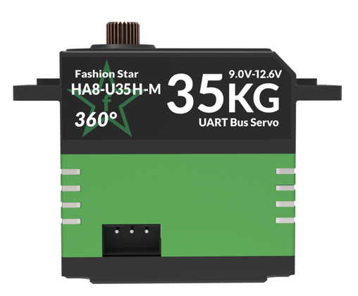
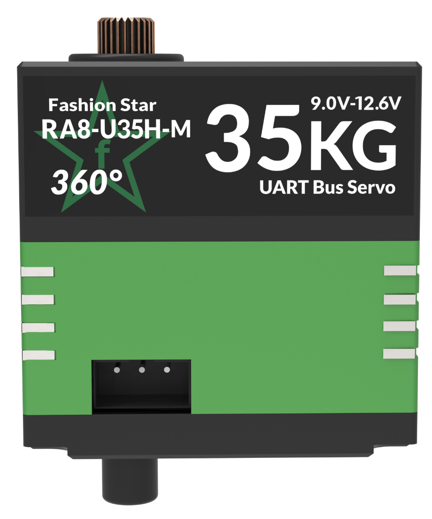
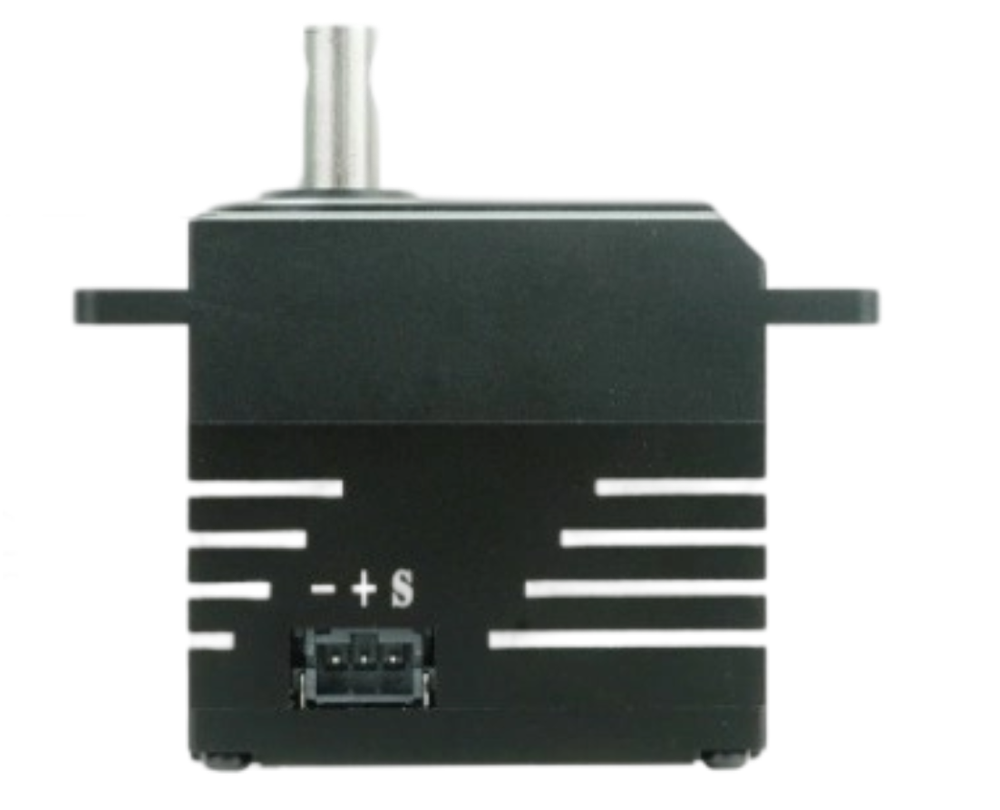
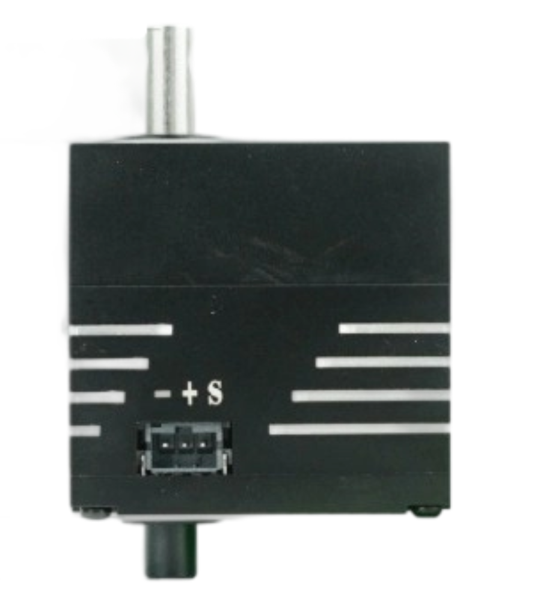

# Differences and Selection Recommendations for Single-Shaft, Dual-Shaft, and D-Shaft Servos

## 1.Servo Naming Rules

| Appearance      | R：Dual-shaft      | H：Single-shaft                    |                                  |
| --------------- | ------------------ | ---------------------------------- | -------------------------------- |
| Motor type      | X：Brushless       | P：Coreless                        | A/L：Cored                       |
| Dimension       | 6：31.5×21×27.6mm  | 8：40×40×20mm                      | 18：63×34×47mm                   |
| Protocols       | U：UART/TTL        | R：RS-485 P：PWM               | C：CAN  A：PWM(programmable) |
| Voltage         | [-]：7.4V          | H：12V                             | W：24V                           |
| Position Sensor | [-]：Potentiometer | M:12-bit magnetic absolute encoder |                                  |

## 2. Core Structural Differences

### 2.1 Single-Shaft Servo（HA8-U35H-M）

The servo has only **one output shaft**, which is the core component that provides rotational torque. The servo housing usually has mounting lugs for fixing the servo itself on only one side.

|               Single-Shaft Servo（HA8-U35H-M）               |                    Bracket Mounting Holes                    |
| :----------------------------------------------------------: | :----------------------------------------------------------: |
|  |  |

### 2.2 Dual-Shaft Servo (RA8-U35H-M)

The servo has an **output shaft** and a **support shaft**. Both sides of the servo housing are provided with mounting holes for fixing the servo itself. The support shaft itself usually does not transmit torque and mainly plays a role in support and positioning.

|                Dual-Shaft Servo (RA8-U35H-M)                 |                 Bracket Mounting Holes(Top)                  |                Bracket Mounting Holes(Bottom)                |
| :----------------------------------------------------------: | :----------------------------------------------------------: | :----------------------------------------------------------: |
|  |  |  |

### 2.3 D-Shaft Servo (HX8-U29H-M | RX8-U29H-M)

|                 D-Shaft Servo (HX8-U29H-M）                  |                 D-Shaft Servo (RXX8-U29H-M）                 |
| :----------------------------------------------------------: | :----------------------------------------------------------: |
|  |  |

## 3. Selection and Installation Recommendations

### 3.1 Single-Shaft Servo (H Type)

Core feature: **Single-side mounting**. It has a simple structure and is suitable for space-constrained scenarios. Installation requirements: Must be paired with a single-side support structural component (e.g., **L-shaped bracket**) to firmly fix the servo housing.

### 3.2 Dual-Shaft Servo (R Type)

Core feature: **Double-side mounting**. Installation requirements: Usually used with a **U-shaped bracket**. The two arms of the bracket fix the two support shafts of the servo respectively, forming a stable support structure.

### 3.3 D-Shaft Servo

Core feature: **D-type output shaft**. Installation requirements: The D-shaft output end must be paired with **a coupling with a corresponding D-shaped hole** to connect the load. The selection of the support structure (single-side or double-side) should still refer to the installation principles of H-type or R-type servos based on load, space, and rigidity requirements.

Please select the appropriate servo type and match it with the corresponding structural bracket according to your project's application scenarios and installation conditions.
