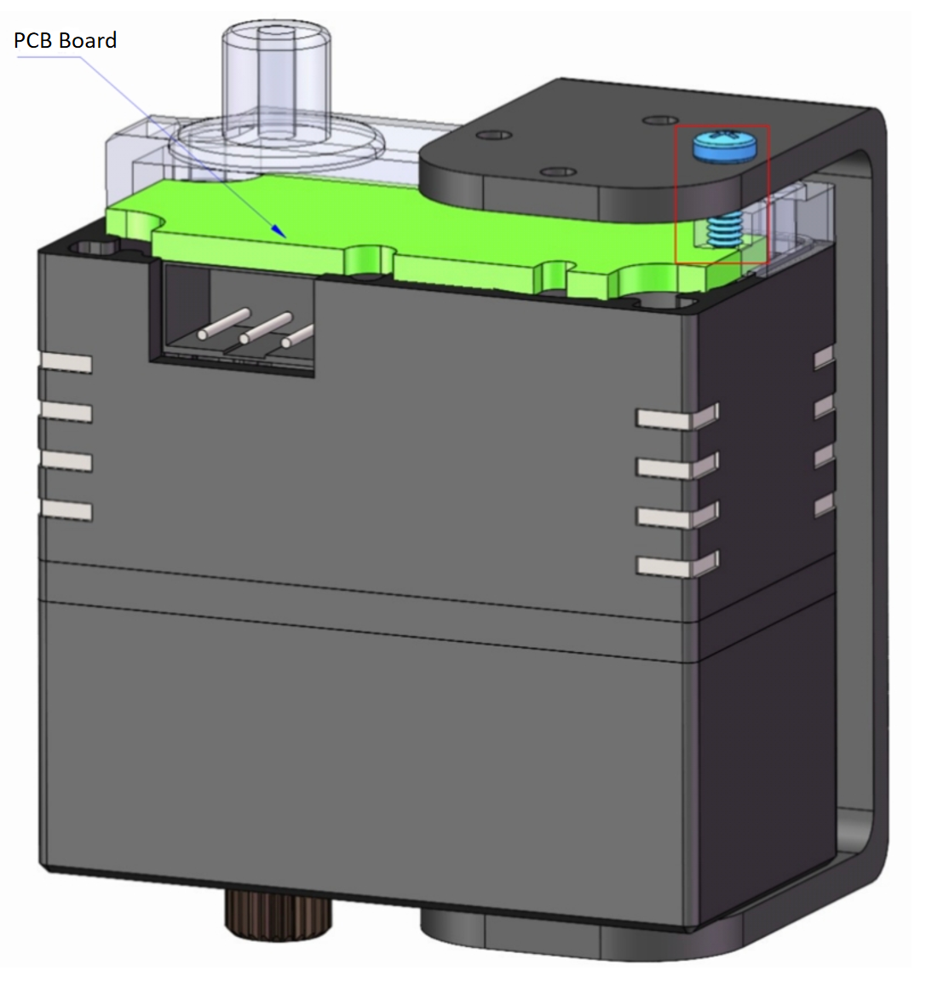

# Installation of Bus Servo Horns and Brackets

## 1. Horn Installation

- **Conventional 25-50KG Servos**

- **100KG Servo**

## 2. Bracket Installation

### 3. Precautions

> [!CAUTION]
>
> The length of the screw that fixes the body and penetrates into the body must not exceed **3mm**. Otherwise, the PCB board will be pierced when locked, causing a short-circuit fault of the servo.

