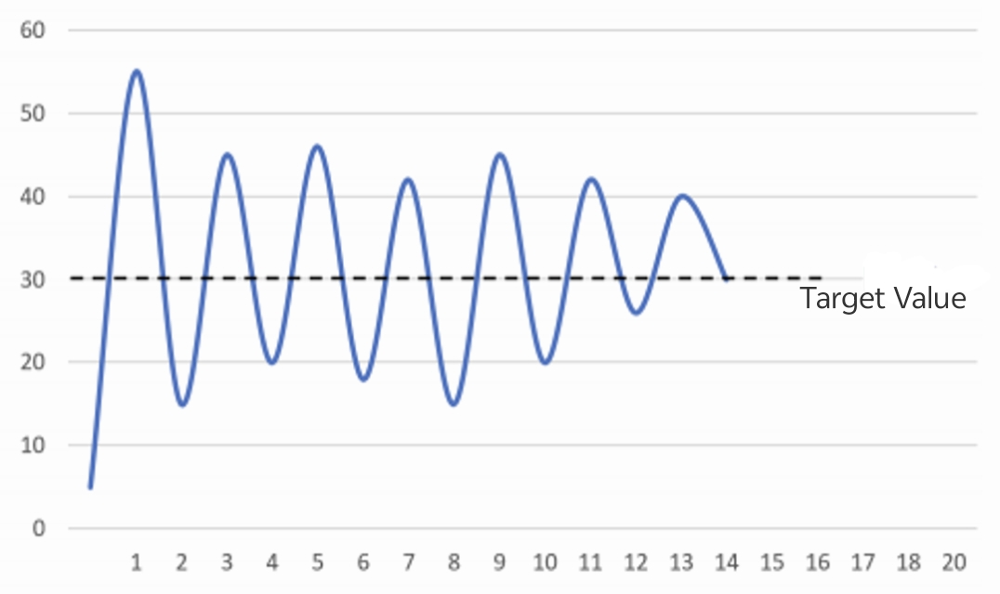

# PID Tuning Method for Bus Servo

## 1. Basic Principle of PID Tuning

- **Kp (Proportional Gain):** Directly affects the system's response speed and overshoot.
- **Ki (Integral Time):** Used to eliminate steady-state error, but may cause system oscillation.
- **Kd (Derivative Time):** Improves system stability and suppresses overshoot, but is sensitive to noise.

> [!NOTE]
>
> This document focuses on control accuracy. PID parameters vary with different loads. For applications requiring "smooth operation" without high precision requirements, the factory-set PID parameters can be used directly.

## 2. Servo PID Tuning Recommendations

### 2.1 Proportional Parameter (P) Tuning Recommendation

First, set the integral coefficients (KI, Hold KI) and derivative coefficients (KD, Hold KD) to zero, putting the system under pure proportional (KP, Hold KP) control. Then gradually increase the proportional gain until the system starts to oscillate. At this point, gradually decrease the proportional gain until the oscillation disappears. Record the proportional gain at this moment and set the system's proportional gain to 60%~70% of this value.

### 2.2 Integral Parameter (I) Tuning Recommendation

The integral coefficients (KI, Hold KI) generally do not need to be set and can remain at 0. If the PD control loop fails to achieve the required precision, set the integral coefficients to 1 (note that this may cause oscillation or jitter).

### 2.3 Derivative Parameter (D) Tuning Recommendation

After determining the proportional gain, gradually increase the derivative coefficients (KD, Hold KD) until the system starts to oscillate. Then gradually decrease the derivative coefficients until the oscillation disappears. Record the derivative gain at this moment and set the system's derivative gain to approximately 30% of this non-oscillating value.

## 3. Precautions During Tuning

- Perform tuning under no-load conditions first, then conduct joint tuning with the load, and fine-tune the PID parameters until the requirements are met.
- Using only one PID parameter is meaningless; at least two parameters should be used, and the proportional term (P) is mandatory. Although PID has three parameters, in most cases, not all three are used. Usually, two parameters are combined: for example, the PD combination is used for systems pursuing stability, and the PI combination is used for systems requiring fast response.
- Of course, PID can be used for systems that require both stability and fast response. However, in practice, more PID parameters make tuning more difficult, and the effect of two parameters is sufficient in many cases.

### 4. PID Reference Values (for Precision)

HP8-U45-M, RP8-U45-M: kp800, ki0, kd5000
