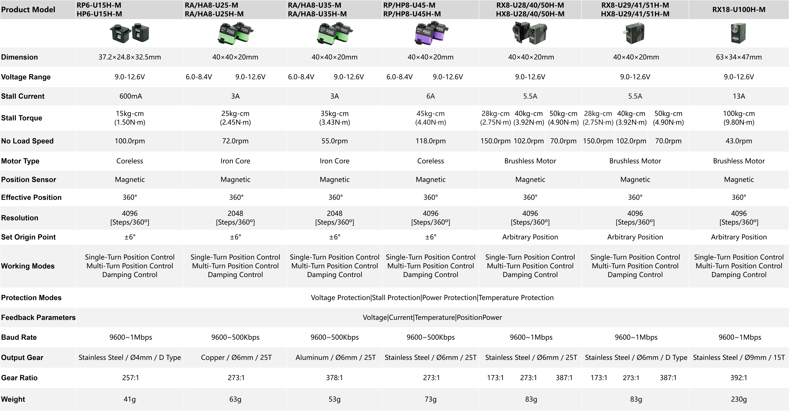

# Product Selection | Model Naming Rules

## 1. Product Selection Table

This selection table is intended to provide users with detailed product selection references. Please note the following points when using it:

- **Protocol Compatibility:** The communication protocols of the entire product series are consistent, and different models can be used in combination.

- **Structural Compatibility:** Products in the 25-50kg series have uniform appearance dimensions and mounting holes, enabling seamless replacement and upgrade.

- **Torque Description:** The marked torque parameter refers to the static torque, i.e., the maximum force the product can bear in a static state. During dynamic motion, the actual bearing torque is usually 30%-40% of the static torque. In design and application, please select products reasonably according to this ratio to ensure that they can work safely and stably under dynamic conditions.

- **Power Supply Selection:** Please configure a power supply with sufficient power according to the voltage and locked-rotor current of the selected product to avoid the product entering protection due to insufficient power.

- **Special Requirements:** If users have special functional requirements, please contact technical support for further consultation and customized services.

  

## 2. Model definition

| Appearance      | R：Dual-shaft      | H：Single-shaft                    |                                  |
| --------------- | ------------------ | ---------------------------------- | -------------------------------- |
| Motor type      | X：Brushless       | P：Coreless                        | A/L：Cored                       |
| Dimension       | 6：31.5×21×27.6mm  | 8：40×40×20mm                      | 18：63×34×47mm                   |
| Protocols       | U：UART/TTL        | R：RS-485 P：PWM               | C：CAN  A：PWM(programmable) |
| Voltage         | [-]：7.4V          | H：12V                             | W：24V                           |
| Position Sensor | [-]：Potentiometer | M:12-bit magnetic absolute encoder |                                  |

**Example Model: RP8-U45H-M**

Dual-shaft Appearance|Coreless Motor|40×20×40mm|UART Communication Protocol|45kg-cm Static Torque|9.0-12.6V|12-bit magnetic absolute encoder
