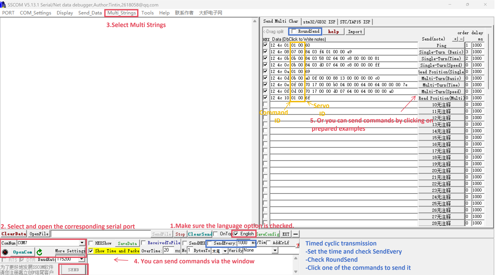

# [Serial Port Assistant] Hexadecimal Command to Control Servo

## 1. Instructions for Use

- Use a **serial port assistant** to simulate various embedded platforms to send hexadecimal commands for servo control and data reading back.
- Provide examples of various hexadecimal control commands to facilitate system debugging.
- When the host computer cannot be installed correctly, use this method to test the basic functions of the servo.

## 2. Wiring Preparation

- [Click to download](https://wiki.fashionstar.com.hk/download/1247/?tmstv=1763447274) (Serial Port Assistant + Command Generation Tool).
- Please connect the bus servo – USB/TTL module – computer in sequence according to the following diagram, and then connect the power supply.

> [!NOTE]
>
> - The corresponding driver needs to be installed in advance. Download address for [CH340G driver](https://www.wch-ic.com/).
> - Ensure that the voltage of the power supply used is within **6.0-8.4v (9.0-12.6v)**; otherwise, the servo will enter voltage protection and fail to work.
> - Ordinary AA battery packs are **not applicable**. It is recommended to use a regulated power supply or a 2s (3s) lithium battery pack.
> - Some regulated power supplies take a long time to power on, which may easily trigger low-voltage protection. It is recommended to turn on the power first and then connect the servo.
> - The factory ID of all servos is set to #0, so please **connect only one servo at a time** for debugging. After the ID is modified, multiple servos can be connected simultaneously.
> - Serial port connection sequence: **TX-RX, RX-TX, GND-GND**, which is also applicable to the serial ports of microcontrollers such as Arduino and STM32.

## 3. Common Hexadecimal Command Examples

- Command Generation Tool

  By entering the corresponding content in the attached table, you can obtain hexadecimal command examples for the **Single-Turn Position Control (Basic)** and **Multi-Turn Position Control (Basic)**.

> [!NOTE]
>
> The yellow parts are the input sections. For example, servo ID 0, angle 90°, time 1s, power 0 (unrestricted).
> The corresponding command after generation is:`12 4C 08 07 00 84 03 E8 03 00 00 DF` (**Servo 0** moves to **90°** within **1s**)

- For detailed command meanings and examples, please refer to the [protocols](https://wiki.fashionstar.com.hk/protocols).

## 4. Use of Serial Port Assistant

As shown in the figure, the operation steps for using the serial port assistant are as follows:

