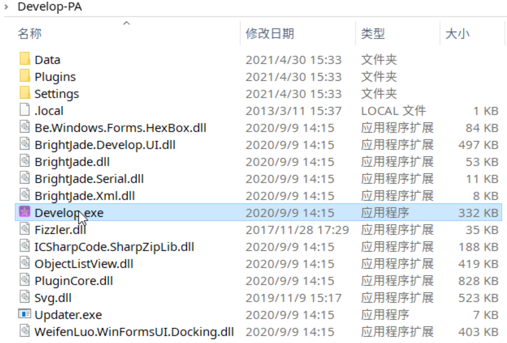

# Programmable PWM Digital Servo

## 1. Overview

​	The programmable PWM digital servo provides comprehensive stall, temperature, and voltage protection without changing the existing PWM input signal format. Meanwhile, users can customize multiple professional parameters through a programmer.

## 2. Download and Installation

 [**Official Download Address**]()

​	After downloading the compressed package, decompress it to complete the installation. Antivirus software may mistakenly report it as a virus. Please disable the antivirus software or add this software to the whitelist as a trusted program.

​	After the software is installed, navigate to the file path of the serial port servo debugging software and double-click to run the `Develop.exe` host computer software, as shown in the following figure:

