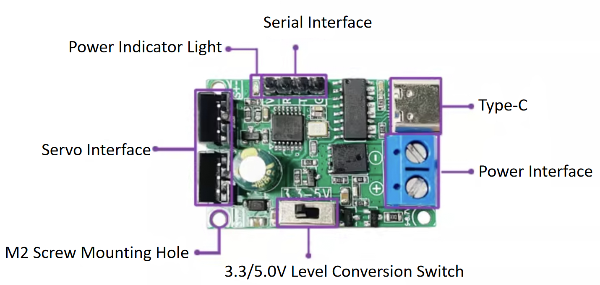
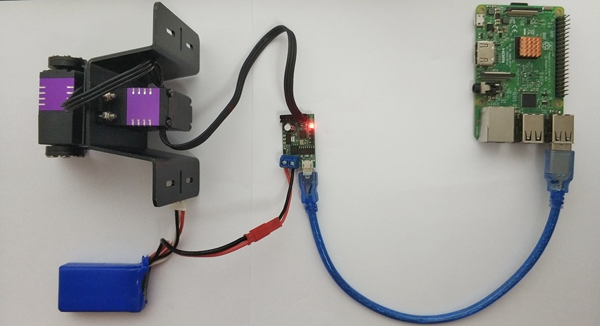
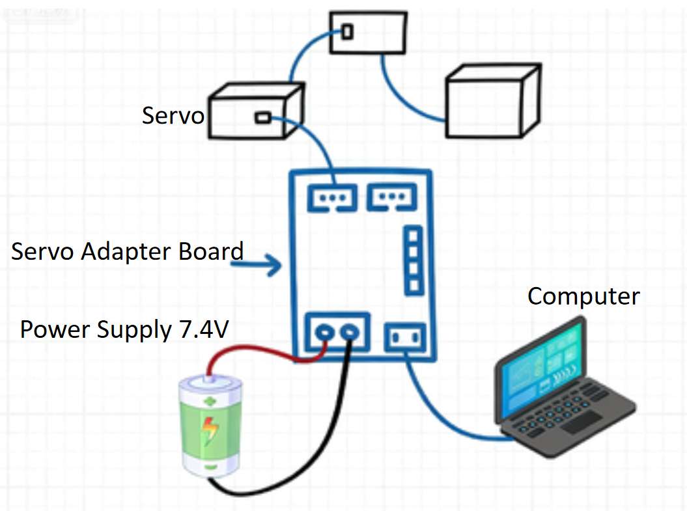
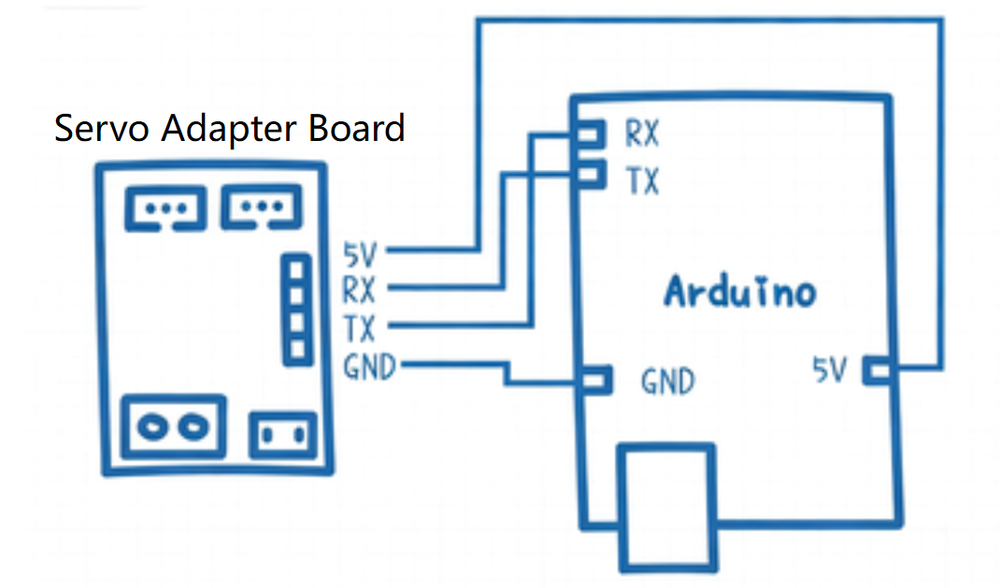
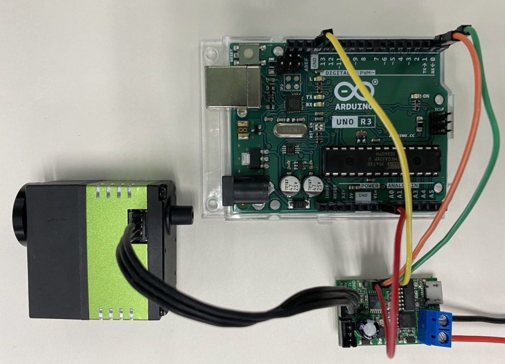

# UC01 Adapter Board — Specifications & Wiring Guide (English)

## 1. Overview

Bus servos must be used together with the [Bus Servo Adapter Board](https://item.taobao.com/item.htm?spm=a230r.1.14.153.2cf553f7OA81It&id=608949258481&ns=1&abbucket=14#detail). The board converts the bus servo’s **single‑wire** interface into a **two‑wire TTL** interface (Rx receive, Tx transmit) so it can communicate with a microcontroller via a standard two‑wire TTL UART. Alternatively, via the on‑board USB‑to‑TTL bridge (CH340), it can communicate with a PC over USB.

## 2. Board Specifications

| Category                 | Value        |
| ------------------------ | ------------ |
| Manufacturer             | Fashion Star |
| Model                    | UC01‑V1.0    |
| Input Voltage Range      | 6–12.6 V     |
| USB Connector Type       | micro USB    |
| USB‑to‑TTL Bridge IC     | CH340        |
| Bus‑servo Ports          | 2            |
| Servo Connector Type     | PH2.0 3‑Pin  |
| Max Servos in Daisy‑chain| 254          |

The board has two servo sockets. Use **either** one to connect a servo to the adapter. The sockets have **reverse‑polarity protection** (keyed design), so you don’t need to worry about plugging it in the wrong way.

Additionally, an **external power supply** powers both the adapter board **and** the servo. **The required external supply voltage depends on the servo’s rated voltage range.**

## 3. Functional Description

### 3.1. Function 1: USB to Single‑wire TTL

Connect the adapter board to a computer using a USB cable.

> [!NOTE]
>
> On Windows, you can use the servo debugging tool to test servo features. On other operating systems, use the SDK to test servo features.

*Real‑world example* — connection between **Raspberry Pi** and a **2‑DoF gimbal**:

### 3.2. Function 2: TTL (two‑wire) to Single‑wire

When using a microcontroller (Arduino/STM32/C51/TI, etc.) to communicate with the servo, connect the adapter board’s **TTL UART header** to the MCU.

*Example wiring* — Arduino:

| UC01 Adapter | Arduino |
| ------------ | ------- |
| GND          | GND     |
| TX           | RX      |
| RX           | TX      |
| 5V           | 5V      |

> [!NOTE]
>
> 1) The adapter operates at **5 V**. Do **not** connect its 5 V pin to a microcontroller’s **3.3 V** rail to avoid damaging the MCU. If the MCU is powered independently, you may leave the adapter’s **5 V** pin **unconnected**.  
> 2) `RX` = receive, `TX` = transmit.

### 3.3. Function 3: USB to TTL UART

The adapter board can also be used as a general‑purpose USB‑to‑TTL UART module.

## 4. USB‑to‑TTL Driver Installation

- The board uses a `CH340` USB‑to‑TTL bridge. **Windows** requires installation of the CH340 driver.

[CH340 Driver Download](https://www.wch.cn/downloads/CH341SER_EXE.html)

- After installation, verify that the driver is installed correctly.

[How to Check if CH340 Driver Is Installed](https://jingyan.baidu.com/article/00a07f3872a90982d028dcb9.html)

## 5. Connecting the Adapter with Other Development Boards

In practice, customers will use different boards and environments. Below are common connection methods between the UC01 and popular dev boards, plus how to control the servos.

### 5.1. Arduino Uno

If you **did not** purchase the Ardurobo2 shield, wire as follows. If you **did** purchase Ardurobo2, simply stack it on the Arduino Uno—no jumper wires required.

| Arduino Uno  | UC01 |
| :----------- | :--- |
| RX (Pin 0)   | TX   |
| TX (Pin 1)   | RX   |
| GND          | GND  |
| Vin          | 5V   |

Power the UC01 and you’re ready.

For control methods, see the [Arduino SDK](https://wiki.fashionstar.com.hk/arduino_uno).

### 5.2. Raspberry Pi

If you **did not** purchase the [Rasprobo2 shield](https://item.taobao.com/item.htm?spm=a1z10.5-c-s.w4002-21603752570.21.513ec686wODmtB&id=612077222339), wire as follows. If you **did** purchase Rasprobo2, stack it directly on the Raspberry Pi—no jumper wires required.

| Raspberry Pi   | UC01 |
| :------------- | :--- |
| RX (Pin 10)    | TX   |
| TX (Pin 8)     | RX   |
| GND (Pin 6)    | GND  |

**Notes:** Power the two boards **independently**. Supply the UC01 via its power input, and power the Raspberry Pi via its **USB Type‑C**. Do **not** attempt to power the Pi from the UC01’s TTL **5 V** pin—the current is insufficient for stable Pi operation. Also connect the UC01’s **Micro‑USB** to one of the Pi’s USB ports.

For control methods, see the [Python SDK]([Python – wiki](https://wiki.fashionstar.com.hk/python)).

### 5.3. STM32F103 “Blue Pill”

If you **did not** purchase the [STM32 Expansion Board PTC‑32](https://item.taobao.com/item.htm?spm=a1z10.5-c-s.w4002-21603752570.27.59b0c686wn0xjU&id=629915375045), wire as follows. If you **did** purchase PTC‑32, use PTC‑32 directly to control the servos.

| STM32F103 GPIO        | UC01 |
| --------------------- | ---- |
| PA_10 (UART1 RX)      | TX   |
| PA_9  (UART1 TX)      | RX   |
| 5V                    | 5V   |
| GND                   | GND  |

Power the UC01 and you’re ready.

For control methods, see the [STM32F103 SDK Manual](https://wiki.fashionrobo.com/uart-stm32f103-sdk/list/).
