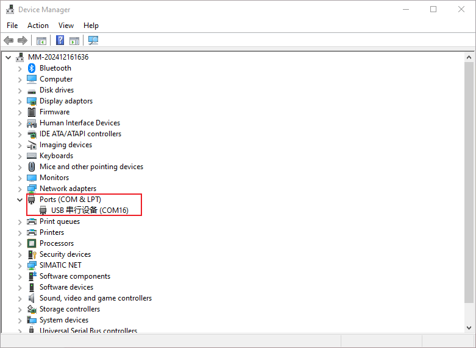
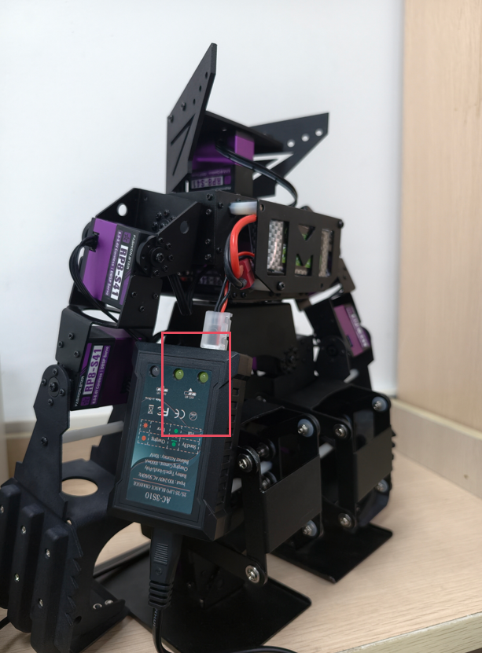

# Frequently Asked Questions

## 1. Solutions for Servo Not Detected

### 1.1 Confirm Connection Sequence

First, turn on the power switch on the robot control board (the red power indicator light will illuminate). Then connect the smaller end of the USB cable to the control board and the other end to the computer. Finally, launch the PC motion editor software.

### 1.2 Verify Micro USB Cable

Some USB cables only support charging and not data transmission, which cannot establish a connection between the robot and the computer. Please use a USB cable with data transmission functionality or the standard-equipped cable provided by us.

### 1.3 Check USB Driver

Failure to install the USB serial port driver will also prevent connection to the robot. Please check whether the USB serial port driver is installed in the computer's Device Manager. Note that the USB serial port number (e.g., COM16) may vary by computer. See the figure below:

## 2. Solutions for Gamepad Not Connecting to Robot

**1. Confirm Gamepad Batteries**

Open the battery cover of the gamepad and insert two AAA batteries.

**2. Check for USB Receiver on Control Board**

Connect the USB receiver to the robot control board.

**3. Confirm Power Switches on Control Board and Gamepad**

Turn on both the power switch of the robot control board and the gamepad.

**4. Verify Gamepad Indicator Light**

- After turning on the power switches of the control board and the gamepad, the robot will automatically pair with the gamepad. A solid green RX indicator light on the gamepad indicates a successful connection.
- If automatic pairing fails, press the analog button "**ANALOG**" on the gamepad. Once the green RX indicator light changes from blinking to solid, the robot can be controlled via the gamepad.

## 3.Handling Abnormal Robot Movements

### 3.1 Servo Unresponsive During Online Debugging

Check if the servo is displayed as "disconnected" in the software and confirm that the **real-time mode** is enabled.
Power off the robot and manually rotate the unresponsive servo. If there is excessive resistance during forward/reverse rotation, the servo may be damaged. Please contact the supplier or the manufacturer's after-sales service.

### 3.2 Servo Not Rotating During Offline Gamepad Operation

If the servo does not rotate when using the gamepad offline, check if the servo connection cable is loose, then power on the robot again.
If the cable is securely connected, power off the robot and manually rotate the servo. Excessive rotation resistance indicates potential servo damage. Please contact the supplier or the manufacturer's after-sales service.

### 3.3 Abnormal Movements After Extended Use

If abnormal movements occur after extended use, check for loose screws in the mechanical structure.
If no loose screws are found, power off the robot and manually rotate the servos. Excessive rotation resistance indicates potential servo damage. Please contact the supplier or the manufacturer's after-sales service.

## 4. Robot Not Functioning

Check if the green operation indicator light on the remote control is solid.

- If the light is off, Follow the remote control's user manual. If the light remains off, verify that the batteries are installed correctly and fully charged. If both are normal, please contact the supplier or the manufacturer's after-sales service.

- If the green indicator light on the remote control keeps blinking: Check if the robot's power switch is turned on. If the robot's green indicator light is blinking, ensure the 2.4G remote control receiver is properly installed. If the issue persists, please contact the supplier or the manufacturer's after-sales service.

  

## 5. Robot Beeping Alarm

### 5.1 Low Battery Detection

Continuous beeping with a blinking red power indicator light during operation indicates a low battery alarm. Please charge the battery promptly to avoid over-discharging and potential battery damage.

### 5.2 Full Battery Detection

A green indicator light on the power adapter means the battery is fully charged; a red light indicates charging in progress.

|                         **Charging**                         |                      **Fully Charged**                       |
| :----------------------------------------------------------: | :----------------------------------------------------------: |
|  |  |
