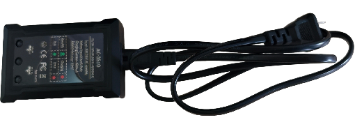
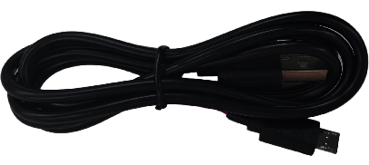

# Introduction to Combat Robot

## 1. Product Overview

### 1.1 Brief Introduction

The 15-axis humanoid combat robot (Model: HR-02) features a high-strength aluminum alloy frame and is equipped with 15 distributed serial bus servos with a maximum torque of 45KG. After the control board is powered on, it automatically assigns servo IDs, eliminating the need for manual configuration. Users can operate it via a PC-based editor or game controller to execute various movements. It can perform forward/backward movement, left/right turning, lateral walking, boxing, and combat actions, meeting the requirements of relevant humanoid combat robot fighting competitions. The robot's main control board reserves a UART serial port, compatible with secondary development using development boards such as Arduino and Micro:bit. It not only satisfies the research needs of robot enthusiasts but also serves as an ideal educational tool for teaching purposes.

### 1.2 Product Features

- **Comprehensive supporting materials and tutorials**: Facilitate beginners to quickly get started and conduct in-depth learning.

- **Dual-axis serial bus servos**: High torque, high precision, and long service life.

- **Multi-channel serial control**: The control board provides multiple serial interfaces; servos are connected in series, allowing flexible wiring based on servo position distribution for a neat layout.

- **Automatic servo ID recognition**: Servo IDs are automatically identified and configured, eliminating the need for pre-assembly ID setting for each servo. Assembly and replacement are simplified.

- **Feedback-based motion editing**: Angle feedback from servos enables motion editing via the PC-based editor.

- **Visual motion editing on PC**: Complete visual motion editors for PC are provided, enabling intuitive adjustment of each servo. Motion editing is feedback-driven, leveraging the servo's built-in feedback function.

  

## 2. Product List

### 2.1 Hardware Composition

The HR-02 15-axis humanoid combat robot consists of a high-strength aluminum alloy frame, 15 RP8-S41 distributed serial bus servos, an SC-01 Bluetooth serial servo controller board, and a 7.4V 1500mAh lithium battery. Its appearance is shown in the figure below:

### 2.2 External Interfaces

- Power Switch
- USB Interface
- Micro-USB Interface

### 2.3 Accessory List

|                PS2 2.4G Remote Control Handle                |                        Power Adapter                         |                       Micro-USB Cable                        |
| :----------------------------------------------------------: | :----------------------------------------------------------: | :----------------------------------------------------------: |
|  |  |  |

## 3. Product Parameters

| Category            | Item                    | Specification                              |
| ------------------- | ----------------------- | ------------------------------------------ |
| Product Parameters  | Product Model           | HR-02                                      |
|                     | Product Dimensions      | 260 × 120 × 430 mm                         |
|                     | Product Weight          | 2.06 kg                                    |
|                     | Body Material           | High-strength aluminum alloy               |
| Power System        | Battery Type            | 7.4 V Li-polymer battery                   |
|                     | Battery Capacity        | 1500 mAh                                   |
|                     | Charging Time           | 1.5 hours                                  |
|                     | Operating Time          | About 20 minutes                           |
| Degrees of Freedom  | Shoulder                | 2 DOF                                      |
|                     | Arm                     | 2 DOF (per arm)                            |
|                     | Leg                     | 3 DOF (per leg)                            |
|                     | Waist                   | 1 DOF                                      |
|                     | Foot                    | 1 DOF (per foot)                           |
| DBSP Control System | Controller              | SC-01 Bluetooth serial servo control board |
|                     | Servo Model             | RP8-S41 serial bus servo                   |
|                     | Servo Torque            | 45 kg @ 7.4 V                              |
|                     | Servo Speed             | 0.098 s/60° @ 7.4 V                        |
|                     | Servo Weight            | 66 g                                       |
|                     | Servo Dimensions        | 40 × 20 × 40 mm                            |
| Motion Editor       | Motion Editing Software | PC-based visual motion editor              |
| Other Parameters    | Remote Controller       | PS2 2.4G wireless remote controller        |

## 4. Notes

> [!NOTE]
>
> - The robot must be operated strictly in accordance with the steps in the user manual to prevent the robot joints from jamming, which would put the servos in a stall state and burn them out. 
> - If a "beep-beep" sound occurs during use, accompanied by the red working indicator light flashing, this is a low-battery alarm. Please charge the battery in a timely manner to avoid battery failure due to over-discharging. 
> - If a joint gets stuck while the robot is in use, quickly turn off the remote control power and then immediately turn off the robot power to avoid damage to the robot servos under stall conditions. 
> - Do not touch the robot when it is not powered off. The robot uses dedicated servos with high torque, which have fast response speed and strong operating force, and may easily cause pinching injuries.
> -  After each use, carefully check that the robot is powered off and fully charge it to prevent battery damage due to undercharging.
