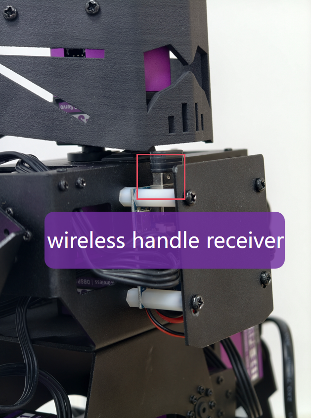
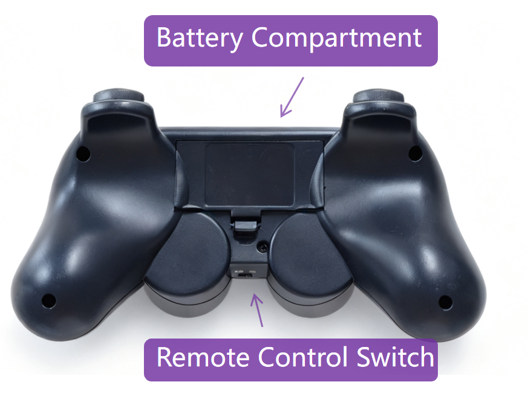
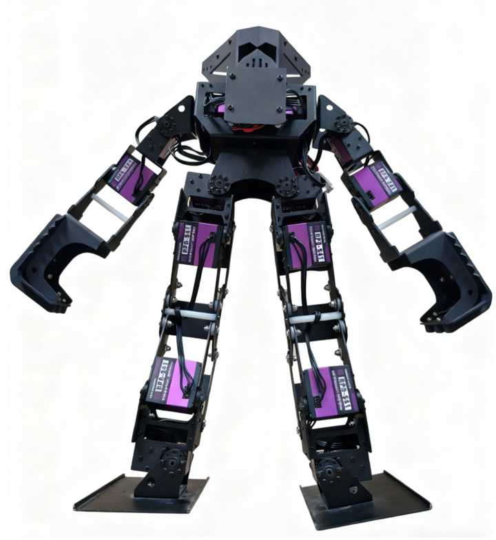
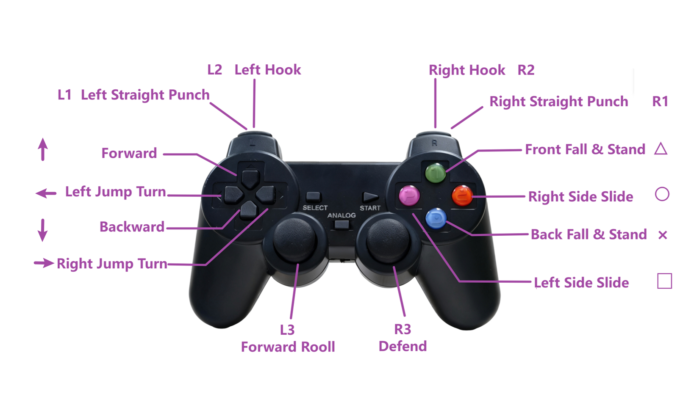

# Quick Start for Combat Robot

# 1. Startup Preparation

### 1.1 Battery Charging

- Before starting the robot, the battery needs to be charged first. **Connect the battery to the power adapter turn on the power to start charging**.

- **Fully Charged Indication**

The power adapter indicator lights show, two red lights always on indicate charging; two green lights always on indicate fully charged.

|                         **Charging**                         |                      **Fully Charged**                       |
| :----------------------------------------------------------: | :----------------------------------------------------------: |
|  |  |

- **Low Battery Indication**

During the use of the robot, if a "beep-beep" sound is emitted and the power indicator (red light) flashes, this is a low-battery alarm. Please charge the battery in time to avoid battery failure due to over-discharging.

> [!CAUTION]
>
> Before charging, turn off the robot's power switch.

- **Robot Charging Time and Usage Duration**

The robot is factory-equipped with an AC-3S10 balance charger with 1A output.

The combat robot has a battery capacity of 1500mAh, taking about 1.5 hours to fully charge and lasting for approximately 20 minutes.

### 1.2 Accessory Assembly

- Install the wireless handle receiver into the USB port of the main board.
- Insert two AAA batteries into the PS2 remote control handle. Note that the remote control switch should be set to the "OFF" position.

|                   wireless handle receiver                   |                  PS2 remote control handle                   |
| :----------------------------------------------------------: | :----------------------------------------------------------: |
|  |  |

### 1.3 Startup Precautions

 Before starting the robot, spread its hands and feet apart, place it face down on the ground.

## 2. Power On

### 2.1 Power-On Sequence

1. Turn on the robot's power switch.
2. Turn on the remote control handle switch; the green indicator light changes from flashing to steady on.
3. If neither the red nor green indicator light is on, press the START button on the handle to activate it.

### 2.2 Indicator Light Description

|              Handle Not Activated               |                Handle Connected Successfully                 |               Bluetooth Not Connected                |
| :---------------------------------------------: | :----------------------------------------------------------: | :--------------------------------------------------: |
| Neither the red nor green indicator light is on | The green indicator light changes from flashing to steady on | Both the red and green indicator lights are flashing |

## 3. Remote Control Handle Operation Instructions

| Name | Button Press         | Button Long Press | Button Release |
| ---- | -------------------- | ----------------- | -------------- |
| ↑    | Pre-forward          | Forward           | Stand          |
| ←    | Left Jump Turn       | Stand             | Stand          |
| →    | Right Jump Turn      | Stand             | Stand          |
| ↓    | Pre-forward          | Backward          | Stand          |
| △    | Front Fall & Stand   | Stand             | Stand          |
| ○    | Right Side Slide     | Right Side Slide  | Stand          |
| □    | Left Side Slide      | Left Side Slide   | Stand          |
| ×    | Back Fall & Stand    | Stand             | Stand          |
| L1   | Left Straight Punch  | Stand             | Stand          |
| L2   | Left Hook            | Stand             | Stand          |
| L3   | Forward Roll         | Forward Roll      | Stand          |
| R1   | Right Straight Punch | Stand             | Stand          |
| R2   | Right Hook           | Stand             | Stand          |
| R3   | Defend               | Defend            | Stand          |
