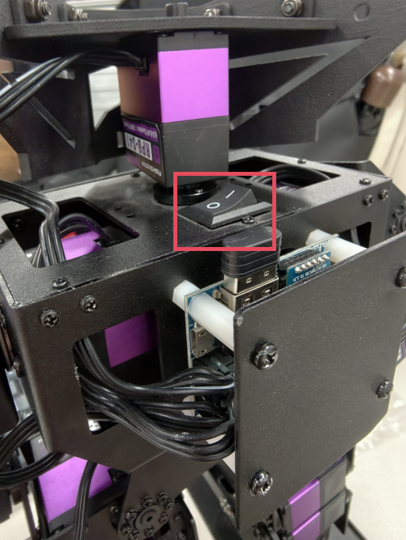
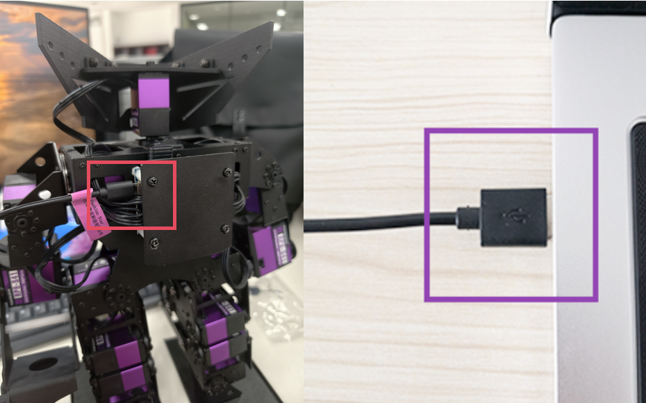
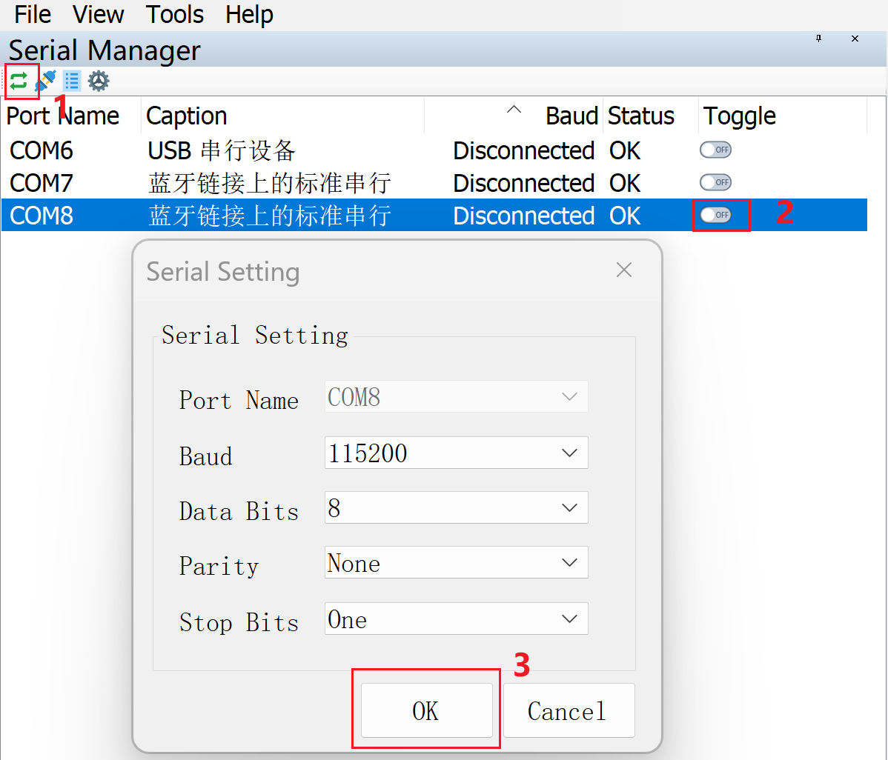
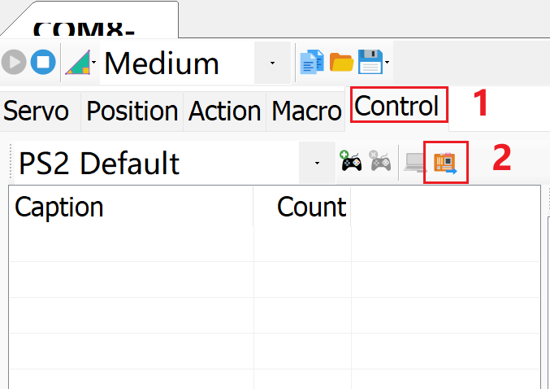

# Adding Preset Motion Groups

## 1. Download and Installation of PC Motion Editor Software

1. Download the [DBSP Serial Servo PC Motion Editor](https://wiki.fashionstar.com.hk/download/1278/?tmstv=1763959815).
2. Extract the downloaded file and install the software to any location for immediate use.

> [!NOTE]
>
> Disable antivirus software such as 360 before installation, as it may block the Develop.exe program.

## 2. Connection Between Robot and PC Motion Editor

### 2.1 Connect to PC

1. Turn on the robot's power switch; the robot will power on (the red power indicator light will stay on).
2. Connect the robot to the computer using a Micro USB data cable.
3. Launch the robot motion editing software **Develop.exe** on the computer.

> [!NOTE]
>
> Follow the connection sequence to connect the robot. Otherwise, the servos cannot be detected.

|                   Turn on the power switch                   |              Connect the robot to the computer               |                      Launch Develop.exe                      |
| :----------------------------------------------------------: | :----------------------------------------------------------: | :----------------------------------------------------------: |
|  |  |  |

### 2.2 Connecting the Serial Port

Click **Refresh** Serial Ports to display the COM port. Select the USB Serial Device, toggle the switch to enable it, verify the serial port settings, and click **OK** to confirm.

## 3. Backing Up Robot Motion Data

First, we back up the original motion files on the robot control board to the computer. The operation steps are as follows:

1. Open the **control** panel.
2. Click the **import data** to upload the robot's motion files to the PC Motion Editor.

