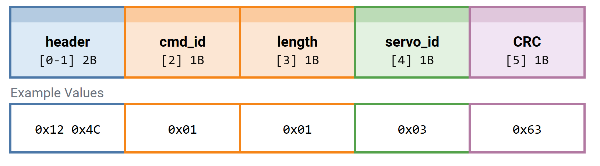
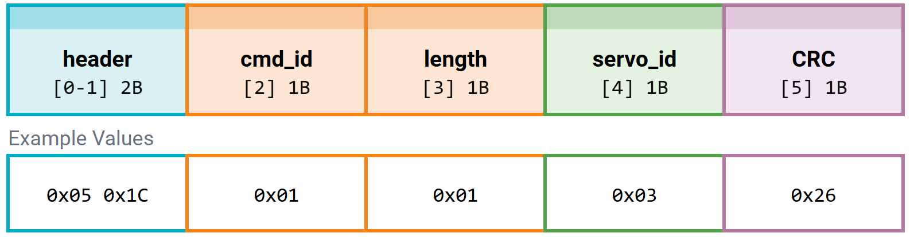
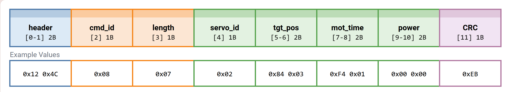
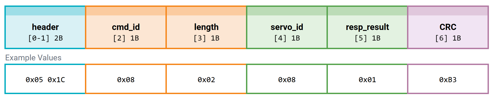
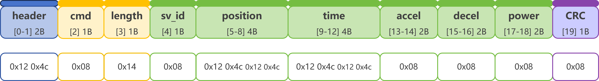
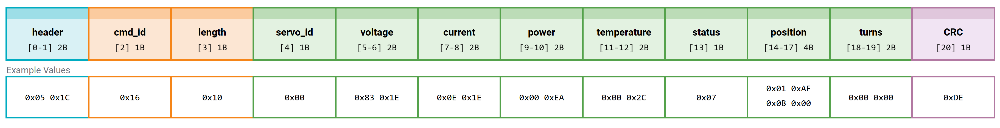

# 总线舵机伺服舵机通信协议

## 版本历史

##  1. 串口通信配置

## 2. 数据类型说明

含 check_sum 说明

## 3. 舵机控制指令

| 指令 ID (dec) | 指令 ID (hex) | 指令名称                     | 请求数据包 (字节) | 响应数据包 字节) |
| :-----------: | :-----------: | ---------------------------- | :---------------: | ---------------- |
|       1       |     0x01      | 通讯检测                     |         6         |                  |
|       8       |     0x08      | 简易单圈角度控制             |                   |                  |
|      11       |     0x0B      | 高级单圈角度控制（基于时间） |                   |                  |
|      12       |     0x0C      | 高级单圈角度控制（基于速度） |                   |                  |
|      10       |     0x0A      | 当前单圈角度读取             |                   |                  |
|      13       |     0x0D      | 简易多圈角度控制             |                   |                  |
|      14       |     0x0E      | 高级多圈角度控制（基于时间） |        20         |                  |
|      15       |     0x0F      | 高级多圈角度控制（基于速度） |        20         |                  |
|      16       |     0x10      | 当前多圈角度读取             |                   |                  |
|      17       |     0x11      | 重置圈数                     |                   |                  |
|       9       |     0x09      | 阻尼控制                     |                   |                  |
|      24       |     0x18      | 停止指令                     |                   |                  |
|      25       |     0x19      | 同步指令                     |                   |                  |
|      18       |     0x12      | 异步写入指令                 |                   |                  |
|      19       |     0x13      | 异步执行指令                 |                   |                  |
|       3       |     0x03      | 数据读取                     |                   |                  |
|      22       |     0x16      | 数据监控                     |                   |                  |
|      23       |     0x17      | 设置原点                     |                   |                  |
|       4       |     0x04      | 自定义配置参数               |                   |                  |
|       5       |     0x05      | 批量读取数据（内部）         |                   |                  |
|       6       |     0x06      | 批量写入数据（内部）         |                   |                  |
|       2       |     0x02      | 恢复出厂配置                 |                   |                  |

## 4. 数据包格式详解

### 4.1. 请求数据包

### 4.2. 响应数据包

### 4.3 校验码计算


## 5. 通讯检测

**请求**

| 参数名     | 数据类型 | 说明                         |
| ---------- | :------: | ---------------------------- |
| `header`   | uint8_t  | 0x12 0x4c                    |
| `cmd_id`   | uint8_t  | 通讯检测 0x01                |
| `length`   | uint8_t  | 1 byte (0x01)                |
| `servo_id` | uint8_t  | 舵机 ID                      |
| `CRC`      | uint8_t  | 校验码 = Σ(Byte[0..4]) % 256 |



```
0x12 0x4c 0x01 0x01 0x03 0x63
```

> **示例说明：**检查3号舵机是否在线。

**响应**

| 参数名     | 数据类型 | 说明                         |
| ---------- | :------: | ---------------------------- |
| `header`   | uint8_t  | 0x05 0x1c                    |
| `cmd_id`   | uint8_t  | 通讯检测 0x01                |
| `length`   | uint8_t  | 1 byte (0x01)                |
| `servo_id` | uint8_t  | 舵机 ID                      |
| `CRC`      | uint8_t  | 校验码 = Σ(Byte[0..4]) % 256 |



```
0x05 0x1c 0x01 0x01 0x03 0x26
```

> **示例说明：**
>
> - 计算并比较理论 `checksum` 与响应报文中的 `checksum`：若一致，则判定 **3号舵机在线**。
> - 建议设置最大等待时间`timeout`，如果超过时间没有收到，则代表舵机不在线。


## 6. 简易单圈角度控制

**请求**

| 参数名     | 数据类型 | 说明                                                         |
| ---------- | :------: | ------------------------------------------------------------ |
| `header`   | uint8_t  | 0x12 0x4c                                                    |
| `cmd_id`   | uint8_t  | 简易单圈角度控制 0x08                                        |
| `length`   | uint8_t  | 7 bytes (0x07)                                               |
| `servo_id` | uint8_t  | 0 ~ 254                                                      |
| `tgt_pos`  | int16_t  | 目标角度-180° ~ +180° (-1800 ~ +1800)                        |
| `mot_time` | uint16_t | 从当前位置到目标位置的运动时间                               |
| `power`    | uint16_t | **0:** 最大功率 当 `power = 0` 或超过 **功率保持值** 时，按 **功率保持值** 执行 |
| `CRC`      | uint8_t  | CRC = Σ(Byte[0..10]) % 256                                   |



```
0x12 0x4c 0x08 0x07 0x02 0x84 0x03 0xf4 0x01 0x00 0x00 0xeb
```

> **示例说明：**设置8号舵机，在500ms内，以最大执行功率旋转到90°。

**响应**

| 参数名        |      | 说明                                                         |
| ------------- | ---- | ------------------------------------------------------------ |
| `header`      |      | 0x05 0x1C                                                    |
| `cmd_id`      |      | 简易单圈角度控制0x08                                         |
| `length`      |      | 2 bytes                                                      |
| `servo_id`    |      | 0 ~ 254                                                      |
| `resp_result` |      | **注意事项：**默认不响应，上位机`指令送出响应`**打开**才有此数据;**1:** 执行成功 \|**0:** 失败 |
| `CRC`         |      | CRC = Σ(Byte[0..5]) % 256                                    |



```
0x05 0x1C 0x08 0x02 0x08 0x01 0xB3
```

> **示例说明：**收到结果为1，指令执行成功。


> [!CAUTION]
>
> **注意事项：**默认没有响应包，只有**指令送出响应开关 = 是**打开响应开关时候才有


## 7. 高级单圈角度控制 (基于时间)

```
0x12 0x4c 0x08 0x07 0x02 0x84 0x03 0xf4 0x01 0x00 0x00 0xeb
```



```
0x05 0x1C 0x08 0x02 0x08 0x01 0xB3
```

> [!CAUTION]
>
> 默认没有响应包，只有指令送出响应开关=是打开响应开关时候才有

## 8. 高级单圈角度控制 (基于速度)

### 

## 9. 单圈当前角度读取

## 10. 简易多圈角度控制

## 11. 高级多圈角度控制 (基于时间)

## 12. 高级多圈角度控制 (基于速度)

## 13. 多圈当前角度读取

## 14. 重置圈数

## 15. 阻尼控制

## 16. 停止指令

## 17. 同步指令

## 18. 异步写入指令

## 19. 异步执行指令

## 20. 数据读取

## 21. 数据监控

**请求**

| 参数名     | 数据类型 | 说明                         |
| ---------- | :------: | ---------------------------- |
| `header`   | uint8_t  | 0x12 0x4c                    |
| `cmd_id`   | uint8_t  | 通讯检测 0x01                |
| `length`   | uint8_t  | 1 byte (0x01)                |
| `servo_id` | uint8_t  | 舵机 ID                      |
| `CRC`      | uint8_t  | 校验码 = Σ(Byte[0..4]) % 256 |


```
0x12 0x4c 0x16 0x01 0x00 0x75
```

> **示例说明：**获取0号舵机数据

**响应**

| 参数名        | 数据类型 | 说明                          |
| ------------- | :------: | ----------------------------- |
| `header`      | uint8_t  | 0x05 0x1c                     |
| `cmd_id`      | uint8_t  | 数据监控                      |
| `length`      | uint8_t  | 1 byte (0x01)                 |
| `servo_id`    | uint8_t  | 舵机 ID                       |
| `voltage`     | uint16_t | 舵机电压                      |
| `current`     | uint16_t | 舵机电压                      |
| `power`       | uint16_t | 舵机功率                      |
| `temperature` | uint16_t | 舵机温度                      |
| `status`      | uint8_t  | 舵机状态                      |
| `position`    | int32_t  | 舵机角度，单位：0.1度         |
| `turns`       | int16_t  | 圈数                          |
| `CRC`         | uint8_t  | 校验码 = Σ(Byte[0..19]) % 256 |



```
0x05 0x1c 0x16 0x10 0x00 0x83 0x1e 0x1e 0x00 0xea 0x00 0x2c 0x07 0x01 0xaf 0x0b 0x00 0x00 0x00 0x00 0xde
```


## 11. 设置原点

## 12. 自定义配置参数

## 批量读取数据（内部）

## 批量写入数据（内部）

## 恢复出厂配置

### 注意事项：只读参数

## 

## 附录

### 1、自定义参数列表

### 2、只读参数列表

