# UART/RS485总线舵机伺服舵机通信协议

**v1.0.25** 

## 1. 简介 

本文档介绍了基于 **UART/RS485 总线** 的舵机通信协议。该协议采用 **异步串行通信** 技术, 为主控设备与多个舵机之间的控制指令传输及状态反馈提供了一种标准化的解决方案。


### **1.1 通信机制**

本协议基于 **半双工异步串行通信**, 使用 **8 位数据位** 、**1 位停止位** , 且不使用奇偶校验。通信中, TxD 和 RxD 不能同时使用, 因此每次只能有一个设备进行数据传输, 其他设备则需要在接收模式下待命。这种半双工通信方式适用于多个设备共享同一通信总线的场景。


### 1.2 舵机ID

在整个通信系统中, 每个舵机都分配了一个唯一的 **ID** , 用来在总线上进行有效的设备寻址。通信采用 **指令-响应** 机制, 确保多设备环境下的可靠交互。协议详细定义了数据封包结构、参数字段、校验规则以及错误处理方法, 以保证舵机能够在各种应用中稳定运行。

> [!NOTE]
>
> 出厂 **默认**的舵机ID为 **0**。


### 1.3 指令间隔

为了确保稳定的通信, 建议 **指令间隔** 为 **5-10ms**。

通过确保足够的时间间隔, 可以有效避免通信超时或错误, 并确保数据包的可靠传输。


## 2. 控制指令

| 指令名称                    |    指令编号    | 响应封包类型 |
| --------------------------- | :------------: | ------------ |
| 通讯检测                    | **01** (0x01)  | 固定         |
| 简易单圈角度控制            | **08**  (0x08) | 可选         |
| 高级单圈角度控制 (基于时间) | **11**  (0x0b) | 可选         |
| 高级单圈角度控制 (基于速度) | **12**  (0x0c) | 可选         |
| 单圈当前角度读取            | **10**  (0x0a) | 固定         |
| 简易多圈角度控制            | **13**  (0x0d) | 可选         |
| 高级多圈角度控制 (基于时间) | **14**  (0x0e) | 可选         |
| 高级多圈角度控制 (基于速度) | **15**  (0x0f) | 可选         |
| 多圈当前角度读取            | **16**  (0x10) | 固定         |
| 停止指令                    | **24**  (0x18) | 可选         |
| 重置圈数                    | **17**  (0x11) | 可选         |
| 阻尼控制                    | **09**  (0x09) | 可选         |
| 设置原点                    | **23**  (0x17) | 可选         |
| 同步指令                    | **25**  (0x19) | /            |
| 异步写入指令                | **18**  (0x12) | 可选         |
| 异步执行指令                | **19**  (0x13) | /            |
| 数据读取                    | **03**  (0x03) | 固定         |
| 数据监控                    | **22**  (0x16) | 固定         |
| 自定义配置参数              | **04**  (0x04) | 可选         |


## 3. 封包结构

### 3.1 指令封包

**指令封包** 是主控向舵机下发控制或查询命令时所使用的标准数据结构。

- **header:** 固定为 `0x12 0x4C`, 用于标识指令封包的起始位置。
- **cmd_id:** 本次封包的控制指令
- **length:** 表示后续数据内容 (content) 的字节数, 用于解析封包。

- **content:** 根据命令字不同, 存放控制参数 (如舵机ID、目标角度、运动时间、功率值等) 。
- **checksum:** 所有字节累加求和后取模 256 的结果, 用于校验数据完整性。

**通信机制:**
主控通过发送指令封包向舵机下发控制或读取请求, 舵机在接收到合法的指令封包后, 会解析参数并返回对应的 **响应封包**。


### 3.2 响应封包

**响应封包** 是舵机在接收到并解析一条合法的 **指令封包** 后, 向主控返回执行结果与相关数据的标准数据结构。

其总体结构与指令封包一致, 仅起始位置标识位和数据内容定义有所区别。

- **header:** 固定为 `0x05 0x1C`, 用于标识指令封包的起始位置。  
- **cmd_id:** 本次封包的控制指令。  
- **length:** 表示后续数据内容 (content) 的字节数, 用于解析封包。  

- **content:** 根据命令字不同, 返回执行结果, 或相应数据 (如当前角度、电压、温度、版本、回读参数等) 。  
- **checksum:** 所有字节累加求和后取模 256 的结果, 用于校验数据完整性。  


> [!NOTE]
>
> **响应封包类型**
>
> - **固定响应类:** 必定返回响应封包。
> - **可配置响应类:** 是否返回取决于由上位机参数`指令发送是否响应` (默认=否) 


> [!TIP]
>
> **建议:** 对时间敏感的批量控制场景 (如多舵机同步控制) , 可关闭可配置响应以减少总线占用；但在调试与故障定位阶段建议开启以便快速定位问题。


## 4. 数据类型

| 数据类型   | 数据名称(cn) | 字节长度 |         最小值 |        最大值 |
| :--------- | :----------- | :------: | -------------: | ------------: |
| uint8_t    | 有符号短整数 |    1     |              0 |           255 |
| uint16_t   | 无符号短整型 |    2     |              0 |        65,535 |
| int16_t    | 有符号短整数 |    2     |        -32,768 |        32,767 |
| uint32_t   | 无符号长整数 |    4     |              0 | 4,294,967,295 |
| int32_t    | 有符号长整数 |    4     | -2,147,483,648 | 2,147,483,647 |
| uint8_t[n] | 变长字节数组 |    n     |                |               |

> [!CAUTION]
>
> 舵机通讯协议里面使用的字节序为 **小端字节序** , 例如一个 `uint16_t`的数值 `4,660`, 它的十六进制表示为 `0x1234`。在发送/接收时, 低位字节在前, 高位字节在后, 即以 `0x34 0x12`形式发送。


## 5. 通讯检测

### 5.1 简介

- 通过发送对应ID 舵机的通讯检测指令, 根据回包情况判断该舵机是否在线。

- 指令编号: **01** (0x01)

  

### 5.2 指令

| 字节名     | 长度 | 数据类型 | 说明                         |
| ---------- | :--: | :------: | ---------------------------- |
| `header`   |  2   | uint16_t | 固定标识 (**0x12 0x4c**)     |
| `cmd_id`   |  1   | uint8_t  | 通讯检测 (**0x01**)          |
| `length`   |  1   | uint8_t  | 1个字节 (**0x01**)           |
| `servo_id` |  1   | uint8_t  | 舵机 ID (范围 0 ~ 254)       |
| `checksum` |  1   | uint8_t  | 校验码 = Σ(Byte[0..4]) % 256 |


```
0x12 0x4c 0x01 0x01 0x00 0x60
```

**示例说明：**

- 检查 **ID 0 **舵机是否在线。


### 5.3 响应

| 字节名     | 长度 | 数据类型 | 说明                         |
| ---------- | :--: | :------: | ---------------------------- |
| `header`   |  2   | uint16_t | 固定标识 ( **0x05 0x1c** )   |
| `cmd_id`   |  1   | uint8_t  | 通讯检测 (**0x01**)          |
| `length`   |  1   | uint8_t  | 1 个字节 (**0x01**)          |
| `servo_id` |  1   | uint8_t  | 舵机 ID (范围 0 ~ 254 )      |
| `checksum` |  1   | uint8_t  | 校验码 = Σ(Byte[0..4]) % 256 |


```
0x05 0x1c 0x01 0x01 0x00 0x23
```

**示例说明：**

- 计算并比较理论 `checksum` 与响应封包中的 `checksum` : 若一致, 则判定 **ID 0 舵机在线**。
- 建议设置最大等待时间`timeout`, 如果超过时间没有收到, 则代表舵机不在线。


## 6. 简易单圈角度控制

### 6.1 简介

- 通过指令控制指定 ID 的舵机 (或全部舵机) , 在设定的 **运动时间** 内移动至 **目标位置** (±180°) , 并可设定 **执行功率**。

- 指令编号: **08** (0x08)

  

### 6.2 指令

| 字节名     | 长度 | 数据类型 | 说明                                                         |
| ---------- | :--: | :------: | ------------------------------------------------------------ |
| `header`   |  2   | uint16_t | 固定标识 (**0x12 0x4c**)                                     |
| `cmd_id`   |  1   | uint8_t  | 简易单圈角度控制(**0x08**)                                   |
| `length`   |  1   | uint8_t  | 7个字节 (**0x07**)                                           |
| `servo_id` |  1   | uint8_t  | 舵机 ID, 范围 0 ~ 254 (0x00 ~ 0xfc ) <BR/>0xff 为线上所有舵机 |
| `position` |  2   | int16_t  | 目标位置, **单位: 0.1°**<BR/>范围 : +1800 ~ -1800 (+CW / −CCW) |
| `time`     |  2   | uint16_t | 运动时间, **单位: ms**                                       |
| `power`    |  2   | uint16_t | 执行功率, **单位: mW**<BR/>若`power=0`, 或大于`功率保护值`, 则都按照`功率保护值`执行 |
| `checksum` |  1   | uint8_t  | 校验码 = Σ(Byte[0..10]) % 256                                |

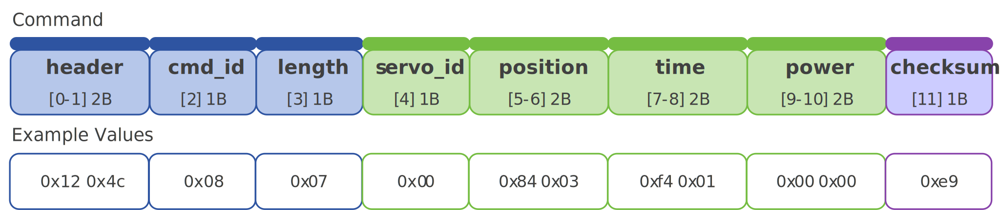

```
0x12 0x4c 0x08 0x07 0x00 0x84 0x03 0xf4 0x01 0x00 0x00 0xe9
```

**示例说明：**

- 设置 **ID 0** 舵机, 
- 在 **500ms** 内移动到目标位置 **+90°**, 
- 将`功率保护值`配置参数设置为最大执行功率, 以 **最大功率** 运行。


### 6.3 响应 (可选)

| 字节名     | 长度 | 数据类型 | 说明                                 |
| ---------- | :--: | :------: | ------------------------------------ |
| `header`   |  2   | uint16_t | 固定标识 (**0x05 0x1c**)             |
| `cmd_id`   |  1   | uint8_t  | 简易单圈角度控制(**0x08**)           |
| `length`   |  1   | uint8_t  | 2个字节 (**0x02**)                   |
| `servo_id` |  1   | uint8_t  | 舵机 ID, 范围 0 ~ 254 (0x00 ~ 0xfc ) |
| `result`   |  1   | uint8_t  | **0x01:** 执行成功 \| **0x00:** 失败 |
| `checksum` |  1   | uint8_t  | 校验码 = Σ(Byte[0..5]) % 256         |


```
0x05 0x1C 0x08 0x02 0x00 0x01 0x2c
```

**示例说明：**

- **ID 0** 舵机返回的值为 **0x01** , 代表 **执行成功**。

> [!CAUTION]
>
> **注意：**默认没有响应包, 仅当上位机设置舵机配置参数`指令送出响应开关`= **是**, 才会回传。


## 7. 高级单圈角度控制 (基于时间)

### 7.1 简介

- 通过指令控制指定 ID 的舵机 (或全部舵机) , 在设定的 **运动时间** 内移动至 **目标位置** (±180°) , 可设定 **执行功率**, 并支持 **加/减速** 参数, 实现梯形加减速运动。

- 指令编号: **11** (0x0b)

  

### 7.2 指令

| 字节名     | 长度 | 数据类型 | 说明                                                         |
| ---------- | :--: | :------: | ------------------------------------------------------------ |
| `header`   |  2   | uint16_t | 固定标识 (**0x12 0x4c**)                                     |
| `cmd_id`   |  1   | uint8_t  | 高级单圈角度控制 (基于时间)(**0x0b**)                        |
| `length`   |  1   | uint8_t  | 11个字节 (**0x0b**)                                          |
| `servo_id` |  1   | uint8_t  | 舵机 ID, 范围 0 ~ 254 (0x00 ~ 0xfc ) <BR/>0xff 为线上所有舵机 |
| `position` |  2   | int16_t  | 目标位置, **单位: 0.1°**<BR/>范围 : +1,800 ~ -1,800 (+CW / −CCW) |
| `time`     |  2   | uint16_t | 运动时间, **单位: ms**                                       |
| `accel`    |  2   | uint16_t | 加速时间, **单位: ms**                                       |
| `decel`    |  2   | uint16_t | 减速时间, **单位: ms**                                       |
| `power`    |  2   | uint16_t | 执行功率, **单位: mW**<BR/>若`power=0`, 或大于`功率保护值`, 则都按照`功率保护值`执行 |
| `checksum` |  1   | uint8_t  | 校验码 = Σ(Byte[0..14]) % 256                                |

> [!WARNING]
>
> 加减速时间设置 **不能小于20ms** , 否则将无法生效。

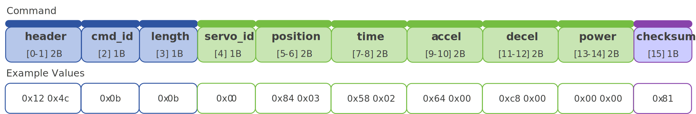

```
0x12 0x4c 0x0b 0x0b 0x00 0x84 0x03 0x58 0x02 0x64 0x00 0xc8 0x00 0x00 0x00 0x81
```

**示例说明：**

- 设置 **ID 0** 舵机, 

- 在 **500 ms**内移动至目标位置 **+90°**, 

- 加速度为 **100 ms**, 减速度为 **200 ms** , 

- 将`功率保护值`配置参数设置为最大执行功率, 以 **最大功率** 运行。

  

### 7.3 响应 (可选)

- 具体内容请参考[6.3. 响应 (可选)](https://wiki.fashionrobo.com/uartbasic/uart_rs485_protocols/#63)。


## 8. 高级单圈角度控制 (基于速度)

### 8.1 简介

- 通过指令控制指定 ID 的舵机 (或全部舵机) , 以设定的 **运动速度** 移动至 **目标位置** (±180°) , 可设定 **执行功率** , 并支持 **加/减速** 参数, 实现梯形加减速运动。

- 指令编号: **12** (0x0b)

  

### 8.2 指令

| 字节名     | 长度 | 数据类型 | 说明                                                         |
| ---------- | :--: | :------: | ------------------------------------------------------------ |
| `header`   |  2   | uint16_t | 固定标识 (**0x12 0x4c**)                                     |
| `cmd_id`   |  1   | uint8_t  | 高级单圈角度控制 (基于速度)(**0x0c**)                        |
| `length`   |  1   | uint8_t  | 11个字节 (**0x0b**)                                          |
| `servo_id` |  1   | uint8_t  | 舵机 ID, 范围 0 ~ 254 (0x00 ~ 0xfc ) <BR/>0xff 为线上所有舵机 |
| `position` |  2   | int16_t  | 目标位置, **单位: 0.1°**<BR/>范围 : +1,800 ~ -1,800 (+CW / −CCW) |
| `speed`    |  2   | uint16_t | 运动速度, **单位: 0.1°/s**                                   |
| `accel`    |  2   | uint16_t | 加速时间, **单位: ms**                                       |
| `decel`    |  2   | uint16_t | 减速时间, **单位: ms**                                       |
| `power`    |  2   | uint16_t | 执行功率, **单位: mW**<BR/>若`power=0`, 或大于`功率保护值`, 则都按照`功率保护值`执行 |
| `checksum` |  1   | uint8_t  | 校验码 = Σ(Byte[0..14]) % 256                                |

> [!WARNING]
>
> 加减速时间设置 **不能小于20ms** , 否则将无法生效。

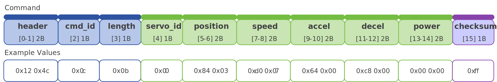

```
0x12 0x4c 0x0c 0x0b 0x00 0x84 0x03 0xd0 0x07 0x64 0x00 0xc8 0x00 0x00 0x00 0xff
```

**示例说明：**

- 设置 **ID 0** 舵机, 

- 以运动速度 **200°/s** 移动至目标位置 **+90°**, 

- 加速度为 **100 ms** , 减速度为 **200 ms** , 

- 将`功率保护值`配置参数设置为最大执行功率, 以 **最大功率** 运行。

  

### 8.3 响应 (可选)

- 具体内容请参考[6.3. 响应 (可选)](https://wiki.fashionrobo.com/uartbasic/uart_rs485_protocols/#63)。


## 9. 单圈当前角度读取

### 9.1 简介

- 通过指令读取指定 ID 的舵机的 **当前角度** , 返回的角度值表示舵机的 **单圈当前位置** (±180°) 。此功能可用于实时监测舵机的运动状态。

- 指令编号: **10** (0x0a)

  

### 9.2 指令

| 字节名     | 长度 | 数据类型 | 说明                                 |
| ---------- | :--: | :------: | ------------------------------------ |
| `header`   |  2   | uint16_t | 固定标识 (**0x12 0x4c**)             |
| `cmd_id`   |  1   | uint8_t  | 单圈当前角度读取(**0x0a**)           |
| `length`   |  1   | uint8_t  | 1个字节 (**0x01**)                   |
| `servo_id` |  1   | uint8_t  | 舵机 ID, 范围 0 ~ 254 (0x00 ~ 0xfc ) |
| `checksum` |  1   | uint8_t  | 校验码 = Σ(Byte[0..4]) % 256         |


```
0x12 0x4c 0x0a 0x01 0x00 0x69
```

**示例说明：**

- 读取 **ID 0** 舵机单圈当前角度。


### 9.3 响应

| 字节名     | 长度 | 数据类型 | 说明                                                         |
| ---------- | :--: | :------: | ------------------------------------------------------------ |
| `header`   |  2   | uint16_t | 固定标识 (**0x05 0x1c**)                                     |
| `cmd_id`   |  1   | uint8_t  | 单圈当前角度读取(**0x0a**)                                   |
| `length`   |  1   | uint8_t  | 3个字节 (**0x03**)                                           |
| `servo_id` |  1   | uint8_t  | 舵机 ID, 范围 0 ~ 254 (0x00 ~ 0xfc )                         |
| `position` |  2   | int16_t  | 目标位置, **单位: 0.1°**<BR/>范围 : +1,800 ~ -1,800 (+CW / −CCW) |
| `checksum` |  1   | uint8_t  | 校验码 = Σ(Byte[0..6]) % 256                                 |


```
0x05 0x1C 0x0a 0x03 0x00 0x86 0x03 0xb7
```

**示例说明：**

- **ID 0** 舵机返回的角度值为 **0x86 0x03** , 通过解包, 得到的值为 **+902** , 
- 将其转换为角度制后, 表示当前舵机的单圈角度为 **+90.2°**。


## 10. 简易多圈角度控制

### 10.1 简介

- 通过指令控制指定 ID 的舵机 (或全部舵机) , 在设定的 **运动时间** 内移动至 **目标位置** (±3,686,400°/1,024圈) , 并可设定 **执行功率**。

- 指令编号: **13** (0x0d)

  

### 10.2 指令

| 字节名     | 长度 | 数据类型 | 说明                                                         |
| ---------- | :--: | :------: | ------------------------------------------------------------ |
| `header`   |  2   | uint16_t | 固定标识 (**0x12 0x4c**)                                     |
| `cmd_id`   |  1   | uint8_t  | 简易多圈角度控制(**0x0d**)                                   |
| `length`   |  1   | uint8_t  | 11个字节 (**0x0b**)                                          |
| `servo_id` |  1   | uint8_t  | 舵机 ID, 范围 0 ~ 254 (0x00 ~ 0xfc ) <BR/>0xff 为线上所有舵机 |
| `position` |  4   | int32_t  | 目标位置, **单位: 0.1°**<BR/>范围 : +3,686,400 ~ -3,686,400 (+CW / −CCW) |
| `time`     |  4   | uint32_t | 运动时间, **单位: ms**                                       |
| `power`    |  2   | uint16_t | 执行功率, **单位: mW**<BR/>若`power=0`, 或大于`功率保护值`, 则都按照`功率保护值`执行 |
| `checksum` |  1   | uint8_t  | 校验码 = Σ(Byte[0..14]) % 256                                |

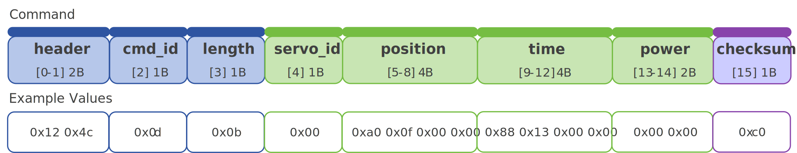

```
0x12 0x4c 0x0d 0x0b 0x00 0xa0 0x0f 0x00 0x00 0x88 0x13 0x00 0x00 0x00 0x00 0xc0
```

**示例说明：**

- 设置 **ID 0** 舵机, 
- 在 **5000ms** 内移动到目标位置 **+400°**, 
- 将`功率保护值`配置参数设置为最大执行功率, 以 **最大功率** 运行。


### 10.3 响应 (可选)

- 具体内容请参考[6.3. 响应 (可选)](https://wiki.fashionrobo.com/uartbasic/uart_rs485_protocols/#63)。


## 11. 高级多圈角度控制 (基于时间)

### 11.1 简介

- 通过指令控制指定 ID 的舵机 (或全部舵机) , 在设定的 **运动时间** 内移动至 **目标位置** (±3,686,400°/1,024圈) , 可设定 **执行功率** , 并支持 **加/减速** 参数, 实现梯形加减速运动。

- 指令编号: **14** (0x0e)

  

### 11.2 指令

| 字节名     | 长度 | 数据类型 | 说明                                                         |
| ---------- | :--: | :------: | ------------------------------------------------------------ |
| `header`   |  2   | uint16_t | 固定标识 (**0x12 0x4c**)                                     |
| `cmd_id`   |  1   | uint8_t  | 高级多圈角度控制 (基于时间)(**0x0e**)                        |
| `length`   |  1   | uint8_t  | 15个字节 (**0x0f**)                                          |
| `servo_id` |  1   | uint8_t  | 舵机 ID, 范围 0 ~ 254 (0x00 ~ 0xfc ) <BR/>0xff 为线上所有舵机 |
| `position` |  4   | int32_t  | 目标位置, **单位: 0.1°**<BR/>范围 : +3,686,400 ~ -3,686,400 (+CW / −CCW) |
| `time`     |  4   | uint32_t | 运动时间, **单位: ms**                                       |
| `accel`    |  2   | uint16_t | 加速时间, **单位: ms**                                       |
| `decel`    |  2   | uint16_t | 减速时间, **单位: ms**                                       |
| `power`    |  2   | uint16_t | 执行功率, **单位: mW**<BR/>若`power=0`, 或大于`功率保护值`, 则都按照`功率保护值`执行 |
| `checksum` |  1   | uint8_t  | 校验码 = Σ(Byte[0..18]) % 256                                |

> [!WARNING]
>
> 加减速时间设置 **不能小于20ms** , 否则将无法生效。

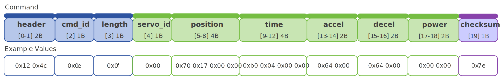

```
0x12 0x4c 0x0e 0x0f 0x00 0x70 0x17 0x00 0x00 0xb0 0x04 0x00 0x00 0x64 0x00 0x64 0x00 0x00 0x00 0x7e
```

**示例说明：**

- 设置 **ID 0** 舵机, 
- 在 **1200 ms** 内移动至目标位置 **+600°**, 
- 加速度为 **100 ms**, 减速度为 **100 ms** , 
- 将`功率保护值`配置参数设置为最大执行功率, 以 **最大功率** 运行。


### 11.3 响应 (可选)

- 具体内容请参考[6.3. 响应 (可选)](https://wiki.fashionrobo.com/uartbasic/uart_rs485_protocols/#63)。


## 12. 高级多圈角度控制 (基于速度)

### 12.1 简介

- 通过指令控制指定 ID 的舵机 (或全部舵机) , 在设定的 **运动速度** 移动至 **目标位置** (±180°) , 可设定 **执行功率** , 并支持 **加/减速** 参数, 实现梯形加减速运动。
- 指令编号: **15** (0x0f)


### 12.2 指令

| 字节名     | 长度 | 数据类型 | 说明                                                         |
| ---------- | :--: | :------: | ------------------------------------------------------------ |
| `header`   |  2   | uint16_t | 固定标识 (**0x12 0x4c**)                                     |
| `cmd_id`   |  1   | uint8_t  | 高级多圈角度控制 (基于速度)(**0x0f**)                        |
| `length`   |  1   | uint8_t  | 13个字节 (**0x0d**)                                          |
| `servo_id` |  1   | uint8_t  | 舵机 ID, 范围 0 ~ 254 (0x00 ~ 0xfc ) <BR/>0xff 为线上所有舵机 |
| `position` |  4   | int32_t  | 目标位置, **单位: 0.1°**<BR/>范围 : +3,686,400 ~ -3,686,400 (+CW / −CCW) |
| `speed`    |  4   | uint32_t | 运动速度, **单位: 0.1°/s**                                   |
| `accel`    |  2   | uint16_t | 加速时间, **单位: ms**                                       |
| `decel`    |  2   | uint16_t | 减速时间, **单位: ms**                                       |
| `power`    |  2   | uint16_t | 执行功率, **单位: mW**<BR/>若`power=0`, 或大于`功率保护值`, 则都按照`功率保护值`执行 |
| `checksum` |  1   | uint8_t  | 校验码 = Σ(Byte[0..16]) % 256                                |

> [!WARNING]
>
> 加减速时间设置 **不能小于20ms** , 否则将无法生效。

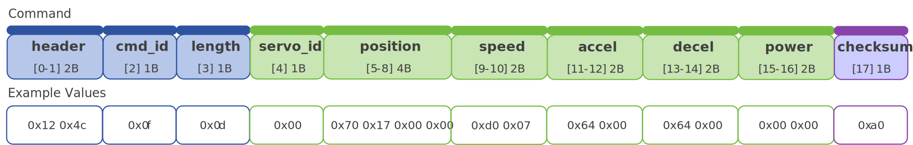

```
0x12 0x4c 0x0f 0x0d 0x00 0x70 0x17 0x00 0x00 0xd0 0x07 0x64 0x00 0x64 0x00 0x00 0x00 0xa0
```

**示例说明：**

- 设置 **ID 0** 舵机, 
- 以运动速度 **200°/s** 移动至目标位置 **+600°**, 
- 加速度为 **100 ms** , 减速度为 **100 ms** , 
- 将`功率保护值`配置参数设置为最大执行功率, 以 **最大功率** 运行。


### 12.3 响应 (可选)

- 具体内容请参考[6.3. 响应 (可选)](https://wiki.fashionrobo.com/uartbasic/uart_rs485_protocols/#63)。


## 13. 多圈当前角度读取

### 13.1 简介

- 通过指令读取指定 ID 的舵机的 **当前角度** , 返回的角度值表示舵机的 **多圈当前位置** (±3,686,400°) , 以及 **圈数信息** (±1,024圈)。此功能可用于实时监测舵机的运动状态。
- 指令编号: **16** (0x10)


### 13.2 指令

| 字节名     | 长度 | 数据类型 | 说明                                 |
| ---------- | :--: | :------: | ------------------------------------ |
| `header`   |  2   | uint16_t | 固定标识 (**0x12 0x4c**)             |
| `cmd_id`   |  1   | uint8_t  | 多圈当前角度读取(**0x10**)           |
| `length`   |  1   | uint8_t  | 1个字节 (**0x01**)                   |
| `servo_id` |  1   | uint8_t  | 舵机 ID, 范围 0 ~ 254 (0x00 ~ 0xfc ) |
| `checksum` |  1   | uint8_t  | 校验码 = Σ(Byte[0..4]) % 256         |


```
0x12 0x4c 0x10 0x01 0x00 0x6f
```

**示例说明：**

- 读取 **ID 0** 舵机多圈当前角度。


### 13.3 响应

| 字节名     | 长度 | 数据类型 | 说明                                                         |
| ---------- | :--: | :------: | ------------------------------------------------------------ |
| `header`   |  2   | uint16_t | 固定标识 (**0x05 0x1c**)                                     |
| `cmd_id`   |  1   | uint8_t  | 多圈当前角度读取(**0x10**)                                   |
| `length`   |  1   | uint8_t  | 7个字节 (**0x07**)                                           |
| `servo_id` |  1   | uint8_t  | 舵机 ID, 范围 0 ~ 254 (0x00 ~ 0xfc )                         |
| `position` |  4   | int32_t  | 目标位置, **单位: 0.1°**<BR/>范围 : +3,686,400 ~ -3,686,400 (+CW / −CCW) |
| `turns`    |  2   | int16_t  | 圈数信息, **单位: 圈**<BR/>范围 : -1024 ~ 1,024              |
| `checksum` |  1   | uint8_t  | 校验码 = Σ(Byte[0..10]) % 256                                |

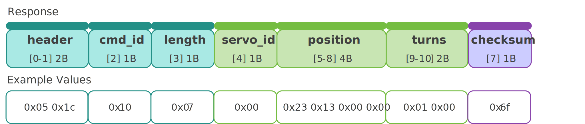

```
0x05 0x1c 0x10 0x07 0x00 0x23 0x13 0x00 0x00 0x01 0x00 0x6f
```

**示例说明：**

- **ID 0** 舵机返回的角度值为 **0x23 0x13 0x00 0x00** , 通过解包, 得到的值为 **+4,899** , 
- 将其转换为角度制后, 表示当前舵机的单圈角度为 **+489.9°**。
- **ID 0** 舵机返回的圈数值为 **0x10 0x00** , 通过解包, 得到的值为 **1**, 
- 结合之前返回的角度值的方向, 表示当前舵机的圈数为 **正1圈**。


## 14. 停止指令

### 14.1 简介

- 停止指令用于舵机运动控制中的快速停止。用户可根据需求选择不同 **停止类型**。该指令还可用于堵转保护后的 **恢复锁力** , 以及在释放锁力状态下 **重新建立** 当前位置的锁力。
- 指令编号: **24** (0x18)

### 14.2 指令

| 字节名     | 长度 | 数据类型 | 说明                                                         |
| ---------- | :--: | :------: | ------------------------------------------------------------ |
| `header`   |  2   | uint16_t | 固定标识 (**0x12 0x4c**)                                     |
| `cmd_id`   |  1   | uint8_t  | 停止指令 (**0x18**)                                          |
| `length`   |  1   | uint8_t  | 4个字节 (**0x04**)                                           |
| `servo_id` |  1   | uint8_t  | 舵机 ID (范围 0 ~ 254 )                                      |
| `mode`     |  1   | uint8_t  | 停止后释放锁力:**0x10**<br/>停止后保持锁力:**0x11**<br/>停止后进入阻尼控制:**0x12** |
| `power`    |  2   | uint16_t | 执行功率, **单位:mW**<BR/>若`power=0`, 或大于`功率保护值`, 则都按照`功率保护值`执行 |
| `checksum` |  1   | uint8_t  | 校验码 = Σ(Byte[0..7]) % 256                                 |

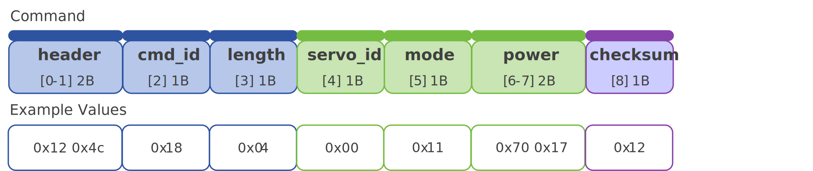

```
0x12 0x4c 0x18 0x04 0x00 0x11 0x70 0x17 0x12
```

**示例说明：**

- 设置 **ID 0** 舵机进入 **停止运动** 状态, 
- 停止模式为 **0x11** , 停止后 **保持锁力** , 执行功率维持在 **6,000mW** , (如果设定功率大于`功率保护值`, 则按照`功率保护值`执行)


### 14.3 响应 (可选)

- 具体内容请参考[6.3. 响应 (可选)](https://wiki.fashionrobo.com/uartbasic/uart_rs485_protocols/#63)。


## 15. 重置圈数

### 15.1 简介

- 通过指令重置舵机的 **圈数信息** , 将当前绝对位置的角度重新记录为当前角度。
- 指令编号: **17** (0x11)


### 15.2 指令

| 字节名     | 长度 | 数据类型 | 说明                         |
| ---------- | :--: | :------: | ---------------------------- |
| `header`   |  2   | uint16_t | 固定标识 (**0x12 0x4c**)     |
| `cmd_id`   |  1   | uint8_t  | 重置圈数 (**0x11**)          |
| `length`   |  1   | uint8_t  | 1个字节 (**0x01**)           |
| `servo_id` |  1   | uint8_t  | 舵机 ID (范围 0 ~ 254 )      |
| `checksum` |  1   | uint8_t  | 校验码 = Σ(Byte[0..4]) % 256 |

> [!WARNING]
>
> 重置圈数指令仅在舵机处于 **释放状态** 时有效。为确保正确执行, 建议先下发 **停止指令** , 再执行重置圈数操作。


```
0x12 0x4c 0x11 0x01 0x00 0x70
```

**示例说明：**

- 假设当前角度为 **+489.9°**, 
- 重置 **ID 0 **舵机的圈数信息, 并将 **当前绝对位置的角度** 重新记录为当前角度, 
- 如果我们再发送读取指令, 则读到的角度为+489.9°-360° = **+129.9°**


### 15.3 响应 (可选)

- 具体内容请参考[6.3. 响应 (可选)](https://wiki.fashionrobo.com/uartbasic/uart_rs485_protocols/#63)。


## 16. 阻尼控制

### 16.1 简介

- 允许舵机在外部力的作用下调整到不同的角度位置, 并可设置 **执行功率**。
- 指令编号: **09** (0X09)


### 16.2 指令

| 字节名     | 长度 | 数据类型 | 说明                                                         |
| ---------- | :--: | :------: | ------------------------------------------------------------ |
| `header`   |  2   | uint16_t | 固定标识 (**0x12 0x4c**)                                     |
| `cmd_id`   |  1   | uint8_t  | 阻尼控制 (**0x09**)                                          |
| `length`   |  1   | uint8_t  | 3个字节 (**0x03**)                                           |
| `servo_id` |  1   | uint8_t  | 舵机 ID (范围 0 ~ 254 )                                      |
| `power`    |  2   | uint16_t | 执行功率, **单位mW**<BR/>若`power=0`, 或大于`功率保护值`, 则都按照`功率保护值`执行 |
| `checksum` |  1   | uint8_t  | 校验码 = Σ(Byte[0..6]) % 256                                 |

> [!WARNING]
>
> 阻尼控制指令仅在舵机处于 **释放状态 **或 **阻尼状态** 时有效。为确保正确执行, 建议先下发 **停止指令** , 再执行阻尼控制操作。


```
0x12 0x4c 0x09 0x03 0x00 0xf4 0x01 0x5f
```

**示例说明：**

- 设置 **ID 0** 舵机为阻尼控制, 
- 执行功率设置为 **500mW**。(如果设定功率大于`功率保护值`, 则按照`功率保护值`执行)


### 16.3 响应 (可选)

- 具体内容请参考[6.3. 响应 (可选)](https://wiki.fashionrobo.com/uartbasic/uart_rs485_protocols/#63)。


## 17. 设置原点

### 17.1 简介

- 通过指令, 将当前位置设定为舵机的 **原点**。
- 指令编号: **23** (0x17)


### 17.2 指令

| 字节名     | 长度 | 数据类型 | 说明                         |
| ---------- | :--: | :------: | ---------------------------- |
| `header`   |  2   | uint16_t | 固定标识 (**0x12 0x4c**)     |
| `cmd_id`   |  1   | uint8_t  | 设定原点 (**0x17**)          |
| `length`   |  1   | uint8_t  | 2个字节 (**0x02**)           |
| `servo_id` |  1   | uint8_t  | 舵机 ID (范围 0 ~ 254 )      |
| `reset`    |  1   | uint8_t  | **0x00** (默认)              |
| `checksum` |  1   | uint8_t  | 校验码 = Σ(Byte[0..5]) % 256 |

> [!WARNING]
>
> 设置原点指令仅在舵机处于 **释放状态** 时有效。为确保正确执行, 建议先下发 **停止指令 **, 再执行设置原点操作。


```
0x12 0x4c 0x17 0x02 0x00 0x00 0x77
```

**示例说明：**

- 设定 **ID 0** 舵机的当前位置为舵机原点。


### 17.3 响应 (可选)

- 具体内容请参考[6.3. 响应 (可选)](https://wiki.fashionrobo.com/uartbasic/uart_rs485_protocols/#63)。


## 18. 同步指令

### 18.1 简介

- 同步指令用于在一条指令中同时下发多个舵机的控制信息。各舵机根据唯一 **ID** 匹配并解析对应参数, 仅执行与自身相关的内容。所有舵机在接收完成后同时启动, 实现多舵机的协同同步动作。
- 指令编号: **25** (0x19)


### 18.2 指令

| 字节名     | 长度 | 数据类型 | 说明                                                         |
| ---------- | :--: | :------: | ------------------------------------------------------------ |
| `header`   |  2   | uint16_t | 固定标识 (**0x12 0x4c**)                                     |
| `cmd_id`   |  1   | uint8_t  | 同步指令 (**0x19**)                                          |
| `length`   |  1   | uint8_t  | (%d*%n+3)个字节                                              |
| `cmd_id`   |  1   | uint8_t  | **[有效同步指令](https://wiki.fashionrobo.com/uartbasic/uart_rs485_protocols/#183)** 编号 |
| `length`   |  1   | uint8_t  | **[有效同步指令](https://wiki.fashionrobo.com/uartbasic/uart_rs485_protocols/#183)** 的`length` **%d** |
| `count`    |  1   | uint8_t  | 舵机个数 **%n**                                              |
| `content`  |  1   | uint8_t  | 有效指令的`content`                                          |
| `checksum` |  1   | uint8_t  | 校验码 = Σ(Byte[0..%d%n+6]) % 256                            |

> [!WARNING]
>
> - 同步指令只适用于 **[有效同步指令](https://wiki.fashionrobo.com/uartbasic/uart_rs485_protocols/#183)** 内的指令。

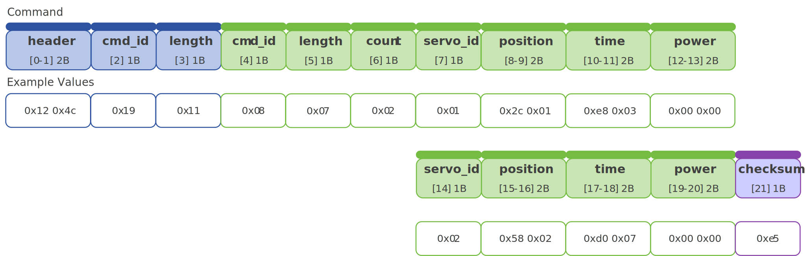

```
0x12 0x4c 0x19 0x11 0x08 0x07 0x02 0x01 0x2c 0x01 0xe8 0x03 0x00 0x00 0x02 0x58 0x02 0xd0 0x07 0x00 0x00  0xE5
```

**示例说明：**

- 向 **ID 1**和 **ID 2** 舵机发送 **同步指令** , 
- 设置 **ID 1** 舵机在 **1000ms** 内移动到目标位置 **+30°** , 将`功率保护值`配置参数设置为最大执行功率, 以 **最大功率** 运行。
- 设置 **ID 2** 舵机在 **2000ms** 内移动到目标位置 **+60°** , 将`功率保护值`配置参数设置为最大执行功率, 以 **最大功率** 运行。
- 两个舵机收到指令后, 同时执行。


### 18.3 有效同步指令

| 指令名称                    |   指令编号    |  指令长度%d   |
| --------------------------- | :-----------: | :-----------: |
| 简易单圈角度控制            | **08** (0x08) | **7** (0x07)  |
| 高级单圈角度控制 (基于时间) | **11** (0x0b) | **11** (0x0b) |
| 高级单圈角度控制 (基于速度) | **12** (0x0c) | **11** (0x0b) |
| 简易多圈角度控制            | **13** (0x0d) | **11** (0x0b) |
| 高级多圈角度控制 (基于时间) | **14** (0x0e) | **15** (0x0f) |
| 高级多圈角度控制 (基于速度) | **15** (0x0f) | **15** (0x0f) |
| 数据监控                    | **22** (0x16) |               |


### 18.4 响应

- 指令本身 **没有** 响应封包。
- 若对应 **ID** 舵机收到的指令有响应封包, 则返回各自的响应数据。


## 19. 异步写入指令

### 19.1 简介

- 异步写入由 **异步写入指令** 与一条 **有效异步指令** 组合构成。
- 指令下发后, 在线舵机会将下一条 **[有效异步指令](https://wiki.fashionrobo.com/uartbasic/uart_rs485_protocols/#193)** 写入自身缓存区, 并在接收到 **[异步执行指令](https://wiki.fashionrobo.com/uartbasic/uart_rs485_protocols/#20)** 时立即执行。
- 指令编号: **18** (0x12)


### 19.2 指令

| 字节名   | 长度 | 数据类型 | 说明                     |
| -------- | :--: | :------: | ------------------------ |
| `header` |  2   | uint16_t | 固定标识 (**0x12 0x4c**) |
| `cmd_id` |  1   | uint8_t  | 同步指令 (**0x12**)      |
| `length` |      |          |                          |

> [!IMPORTANT]
>
> - 指令对 **总线上所有舵机** 生效, 收到后开启缓存区。
> - 缓存区仅允许存放 **一次[有效异步指令](https://wiki.fashionrobo.com/uartbasic/uart_rs485_protocols/#193)** ；
> - 同一个ID 的舵机如果 **再次** 收到指令, 则作为一般指令执行。

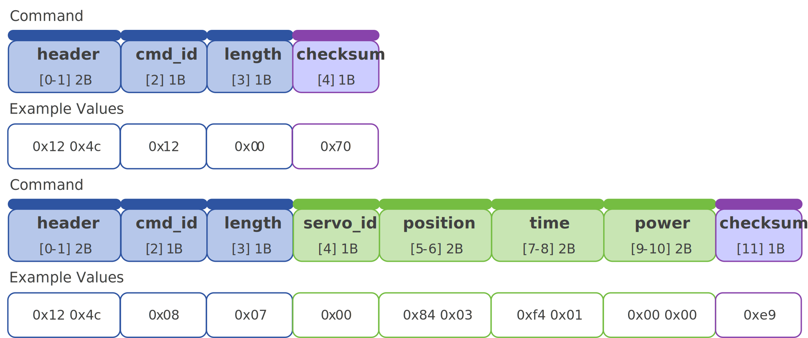

```
0x12 0x4c 0x12 0x00 0x70
0x12 0x4c 0x08 0x07 0x00 0x84 0x03 0xf4 0x01 0x00 0x00 0xe9
```

**示例说明：**

- 第一步 : 下发异步写入指令, 所有在线舵机开启缓存区。
- 第二步 : 下发 **ID 0** 的控制指令, 内容写入缓存区 : 
  - 将 **ID 0** 舵机在 **500 ms** 内移动至目标位置 **+90°**；
  - 将 `功率保护值` 配置为最大执行功率, 并以 **最大功率** 运行。


### 19.3 有效异步指令

| 指令名称                    |   指令编号    |  指令长度%d   |
| --------------------------- | :-----------: | :-----------: |
| 简易单圈角度控制            | **08** (0x08) | **7** (0x07)  |
| 高级单圈角度控制 (基于时间) | **11** (0x0b) | **11** (0x0b) |
| 高级单圈角度控制 (基于速度) | **12** (0x0c) | **13** (0x0d) |
| 简易多圈角度控制            | **13** (0x0d) | **11** (0x0b) |
| 高级多圈角度控制 (基于时间) | **14** (0x0e) | **15** (0x0f) |
| 高级多圈角度控制 (基于速度) | **15** (0x0f) | **15** (0x0f) |


### 19.4 响应

- 异步写入指令没有响应封包。
- 有效异步指令响应封包具体内容请参考[6.3. 响应 (可选)](https://wiki.fashionrobo.com/uartbasic/uart_rs485_protocols/#6)。


## 20. 异步执行指令

### 20.1 简介

- 异步执行指令用于触发缓存区中的命令执行, 完成后清空并关闭缓存区。
- 指令编号: **19** (0x13)


### 20.2 指令

| 字节名     | 长度 | 数据类型 | 说明                             |
| ---------- | :--: | :------: | -------------------------------- |
| `header`   |  2   | uint16_t | 固定标识 (**0x12 0x4c**)         |
| `cmd_id`   |  1   | uint8_t  | 同步指令 (**0x13**)              |
| `length`   |  1   | unit8_t  | 1个字节 (**0x01**)               |
| `action`   |  1   | unit8_t  | **0x01:** 取消 \| **0x00:** 执行 |
| `checksum` |  1   | unit8_t  | 校验码 = Σ(Byte[0..4]) % 256     |

> [!CAUTION]
>
> - 无论执行还是取消, 舵机缓存都会被清空并关闭。
>
> - 断电后, 缓存内容自动失效。


```
0x12 0x4c 0x13 0x01 0x00 0x72
```

**示例说明：**

- 执行 **[异步执行指令](https://wiki.fashionrobo.com/uartbasic/uart_rs485_protocols/#20)**, 
- 清空并关闭所有舵机寄存器


### 20.3 响应

- 此指令 **没有** 响应封包。

  

## 21. 数据读取

### 21.1 简介

- 通过发送指令, 可 **单个** 获取舵机的工作状态参数 (电压、电流、温度等) 及配置参数；相关信息由响应数据包返回。
- 指令编号: **03** (0x03)


### 21.2 指令

| 字节名     | 长度 | 数据类型 | 说明                                                         |
| ---------- | :--: | :------: | ------------------------------------------------------------ |
| `header`   |  2   | uint16_t | 固定标识 (**0x12 0x4c**)                                     |
| `cmd_id`   |  1   | uint8_t  | 数据读取 (**0x03**)                                          |
| `length`   |  1   | uint8_t  | 2个字节 (**0x02**)                                           |
| `servo_id` |  1   | uint8_t  | 舵机 ID (范围 0 ~ 254 )                                      |
| `data_id`  |  1   | uint8_t  | 请参考 [工作状态参数](https://wiki.fashionrobo.com/uartbasic/uart_rs485_protocols/#_1) 和 [舵机配置参数](https://wiki.fashionrobo.com/uartbasic/uart_rs485_protocols/#_1) |
| `checksum` |  1   | uint8_t  | 校验码 = Σ(Byte[0..5]) % 256                                 |


```
0x12 0x4c 0x03 0x02 0x00 0x03 0x66
```

**示例说明：**

- 读取 **ID 0** 舵机的当前功率, 


### 21.3 响应

| 字节名         | 长度 | 数据类型  | 说明                                                         |
| -------------- | :--: | :-------: | ------------------------------------------------------------ |
| `header`       |  2   | uint16_t  | 固定标识 (**0x05 0x1c**)                                     |
| `cmd_id`       |  1   |  uint8_t  | 数据读取 (**0x03**)                                          |
| `length`       |  1   |  uint8_t  | 3个字节 (**0x03**)                                           |
| `servo_id`     |  1   |  uint8_t  | 舵机 ID, 范围 0 ~ 254 (0x00 ~ 0xfc )                         |
| `data_content` | 1/2  | int8/16_t | 根据指令读取的参数的返回值, <BR>详细参考 [工作状态数据](https://wiki.fashionrobo.com/uartbasic/uart_rs485_protocols/#_1)  和 [舵机配置参数](https://wiki.fashionrobo.com/uartbasic/uart_rs485_protocols/#_1) |
| `checksum`     |  1   |  uint8_t  | 校验码 = Σ(Byte[0..6]) % 256                                 |

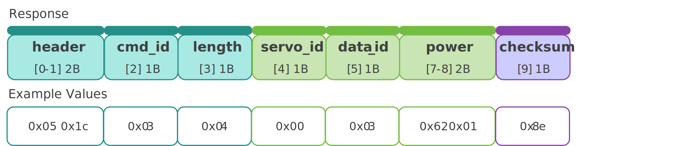

```
0x05 0x1C 0x03 0x04 0x00 0x03 0x62 0x01 0x8e
```

**示例说明：**

- **ID 0** 舵机返回的功率值为 **0x62 0x01** , 通过解包, 得到的值为 **+354** , 表示当前舵机功率为 **354mW**。


## 22. 数据监控

### 22.1 简介

- 通过发送指令, 可 **批量** 获取舵机的工作状态参数 (角度、电压、电流、温度等) ；相关信息由响应数据包返回。
- 指令编号: **22** (0x16)


### 22.2 指令

| 字节名     | 长度 | 数据类型 | 说明                                 |
| ---------- | :--: | :------: | ------------------------------------ |
| `header`   |  2   | uint16_t | 固定标识 (**0x12 0x4c**)             |
| `cmd_id`   |  1   | uint8_t  | 数据监控 (**0x16**)                  |
| `length`   |  1   | uint8_t  | 1个字节 (**0x01**)                   |
| `servo_id` |  1   | uint8_t  | 舵机 ID, 范围 0 ~ 254 (0x00 ~ 0xfc ) |
| `checksum` |  1   | uint8_t  | 校验码 = Σ(Byte[0..4]) % 256         |


```
0x12 0x4c 0x16 0x01 0x00 0x75
```

**示例说明：**

- 获取 **ID 0 **舵机的工作状态数据。


### 22.3 响应

| 字节名        | 长度 | 数据类型 | 说明                                                         |
| ------------- | :--: | :------: | ------------------------------------------------------------ |
| `header`      |  2   | uint16_t | 固定标识 ( **0x05 0x1c** )                                   |
| `cmd_id`      |  1   | uint8_t  | 数据监控 (**0x16**)                                          |
| `length`      |  1   | uint8_t  | 16 个字节 (**0x10**)                                         |
| `servo_id`    |  1   | uint8_t  | 舵机 ID (范围 0 ~ 254 )                                      |
| `voltage`     |  2   | uint16_t | 当前工作电压, **单位: mV**                                   |
| `current`     |  2   | uint16_t | 当前工作电流, **单位: mA**                                   |
| `power`       |  2   | uint16_t | 当前执行功率, **单位: mW**                                   |
| `temperature` |  2   | uint16_t | 当前工作温度, 请参考[ADC–温度映射表](https://wiki.fashionrobo.com/uartbasic/uart_rs485_protocols/#_1) |
| `status`      |  1   | uint8_t  | 状态标志位                                                   |
| `position`    |  4   | uint32_t | 当前角度, **单位: 0.1°**                                     |
| `turns`       |  2   | int16_t  | 当前圈数, **单位: 圈**                                       |
| `checksum`    |  1   | uint8_t  | 校验码 = Σ(Byte[0..19]) % 256                                |

> [!TIP]
>
> 建议设置最大等待时间`timeout`, 如果超过时间没有收到, 则代表舵机不在线。

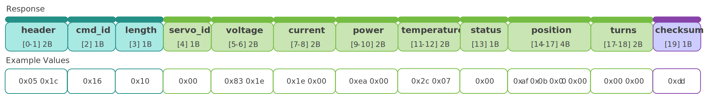

```
0x05 0x1c 0x16 0x10 0x00 0x83 0x1e 0x1e 0x00 0xea 0x00 0x2c 0x07 0x00 0xaf 0x0b 0x00 0x00 0x00 0x00 0xdd
```

**示例说明：**

- 通过解包 **ID 0 舵机** 的响应数据, 获得工作状态数据如下
  - ID: `0x00 = 0`
  - 电压：`0x1e 0x83 = 7811` mV
  - 电流：`0x00 0x1e = 30` mA
  - 功率：`0x00 0xea = 234` mW
  - 温度：`0x07 0x2C = 1836` adc值
  - 状态：`0x00 = 0`
  - 角度：`0x00 0x00 0x0b 0xaf = 2991` 299.1度
  - 圈数：`0x00 0x00 = 0`


## 23. 自定义配置参数

### 23.1 简介

- 通过指令写入舵机配置参数。
- 指令编号: **04** (0x04)


### 23.2  指令

| 字节名         | 长度 | 数据类型  | 说明                                                         |
| -------------- | :--: | :-------: | ------------------------------------------------------------ |
| `header`       |  2   | uint16_t  | 固定标识 (**0x12 0x4c**)                                     |
| `cmd_id`       |  1   |  uint8_t  | 自定义配置参数 (**0x04**)                                    |
| `length`       |  1   |  uint8_t  | 2个字节 (**0x02**)                                           |
| `servo_id`     |  1   |  uint8_t  | 舵机 ID (范围 0 ~ 254 )                                      |
| `data_id`      |  1   |  uint8_t  | 请参考 [舵机配置参数](https://wiki.fashionrobo.com/uartbasic/uart_rs485_protocols/#_1) |
| `data_content` |  n   | int8/16_t | 请参考 [舵机配置参数](https://wiki.fashionrobo.com/uartbasic/uart_rs485_protocols/#_1) |
| `checksum`     |  1   |  uint8_t  | 校验码 = Σ(Byte[0..n+6]) % 256                               |


### 23.3 响应 (可选)

- 具体内容请参考[6.3. 响应 (可选)](https://wiki.fashionrobo.com/uartbasic/uart_rs485_protocols/#63)。


## 附录

### A. 工作状态参数

| data_id | 参数名称   | 数据类型 | 单位 | 备注                                                         |
| :-----: | :--------- | :------: | :--: | ------------------------------------------------------------ |
|    1    | 电压       | uint16_t |  mV  |                                                              |
|    2    | 电流       | uint16_t |  mA  |                                                              |
|    3    | 功率       | uint16_t |  mW  |                                                              |
|    4    | 温度       | uint16_t | ADC  | 请参考 **ADC–温度映射表**                                    |
|    5    | 状态标志位 | uint8_t  |      | BIT[0] - 指令执行中置1, 执行完毕后清零<BR>BIT[1] - 指令执行错误置1, 下次正确执行后清零<BR>BIT[2] - 堵转保护置1, 堵转解除后清零<BR>BIT[3] - 高压保护置1, 电压正常后清零<BR>BIT[4] - 低压保护置1, 电压正常后清零<BR>BIT[5] - 过流保护置1, 电流正常后清零<BR>BIT[6] - 功率保护置1, 功率正常后清零<BR>BIT[7] - 温度保护置1, 温度正常后清零 |

**ADC–温度映射表**<a id="ADC"></a>

| 温度(℃) | ADC  | 温度(℃) | ADC  | 温度(℃) | ADC  |
| :-----: | :--: | :-----: | :--: | :-----: | :--: |
|   50    | 1191 |   60    | 941  |   70    | 741  |
|   51    | 1164 |   61    | 918  |   71    | 723  |
|   52    | 1137 |   62    | 897  |   72    | 706  |
|   53    | 1110 |   63    | 876  |   73    | 689  |
|   54    | 1085 |   64    | 855  |   74    | 673  |
|   55    | 1059 |   65    | 835  |   75    | 657  |
|   56    | 1034 |   66    | 815  |   76    | 642  |
|   57    | 1010 |   67    | 796  |   77    | 627  |
|   58    | 986  |   68    | 777  |   78    | 612  |
|   59    | 963  |   69    | 759  |   79    | 598  |

### B. 舵机配置参数

| data_id | 参数名称         | 数据类型 | 单位 | 备注                                                         |
| :-----: | :--------------- | :------: | :--: | :----------------------------------------------------------- |
|   33    | 指令响应开关     | uint8_t  |      | **0x00:**不发送响应封包 (**默认**)<BR>**0x01:**发送响应封包  |
|   34    | 舵机 ID          | uint8_t  |      | 范围 0 ~ 254                                                 |
|   36    | 波特率配置       | uint8_t  |      | 0x01 - 9,600<BR>0x02 - 19,200<BR>0x03 - 38,400<BR>0x04 - 57,600<BR>**0x05 - 115,200 (默认) **<BR>0x06 - 250,000<BR>0x07 - 500,000<BR>0x08 - 1,000,000 |
|   37    | 堵转保护开关     | uint8_t  |      | 当舵机运行超过`功率保护值`的时候<BR>**0x00:** (堵转保护-关), 降低至功率保护值运行 (**默认**)<BR>**0x01:** (堵转保护-开), 舵机释放锁力 |
|   38    | 堵转功率上限     | uint16_t |  mW  |                                                              |
|   39    | 电压保护下限     | uint16_t |  mV  |                                                              |
|   40    | 电压保护上限     | uint16_t |  mV  |                                                              |
|   41    | 温度保护值       | uint16_t | ADC  |                                                              |
|   42    | 功率保护值       | uint16_t |  mW  |                                                              |
|   43    | 电流保护值       | uint16_t |  mA  |                                                              |
|   46    | 舵机上电锁力开关 | uint8_t  |      | **0x00:** 释放锁力 (**默认**)<BR>**0x01:** 维持锁力          |
|   48    | 角度限制开关     | uint8_t  |      | **0x00:** 关闭 (**默认**)<BR>**0x01:** 开启                  |
|   49    | 上电缓启动开关   | uint8_t  |      | **0x00:** 关闭 (**默认**)<BR>**0x01:** 开启                  |
|   50    | 上电缓启动时间   | uint16_t |  ms  |                                                              |
|   51    | 舵机角度上限     | int16_t  | 0.1° |                                                              |
|   52    | 舵机角度下限     | int16_t  | 0.1° |                                                              |

